下载安装包[Anaconda安装包下载（清华镜像）](https://mirrors.tuna.tsinghua.edu.cn/anaconda/)

# Step1:安装Anaconda

## Next

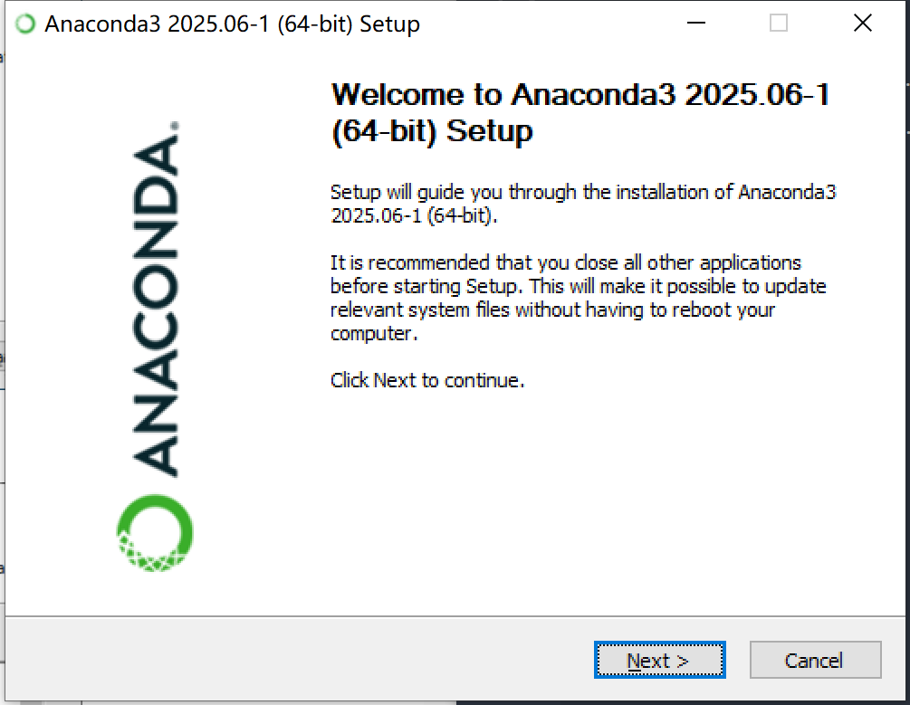

## 同意协议

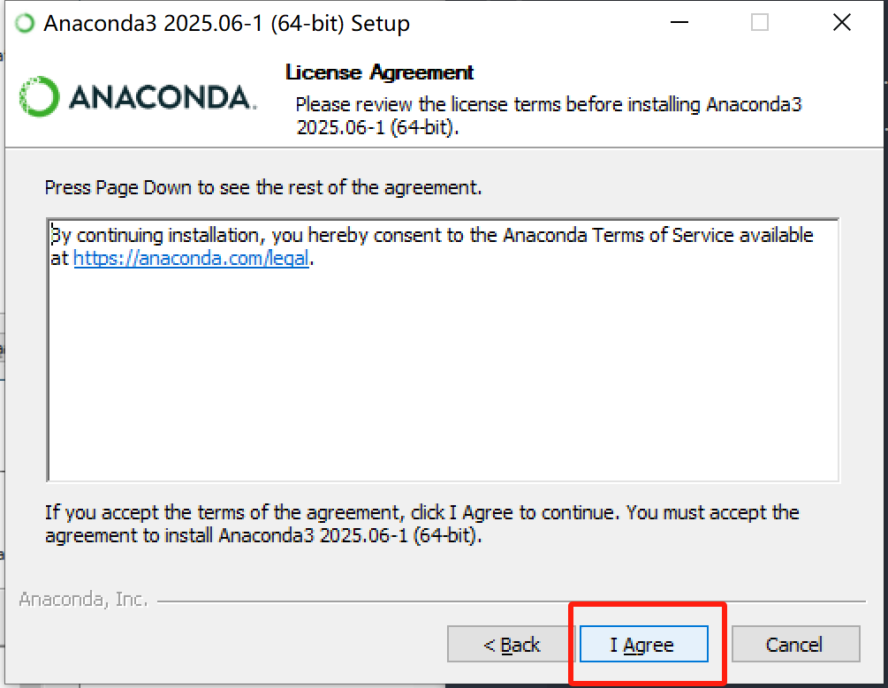

## 最好选择为所有用户安装，这样Anaconda有管理员权限，会避免一些权限错误

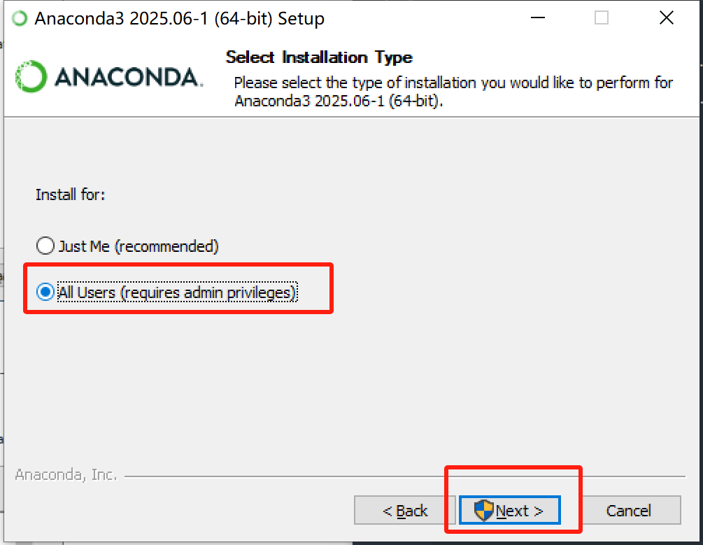

## 这里的安装位置即%CONDA_HOME%

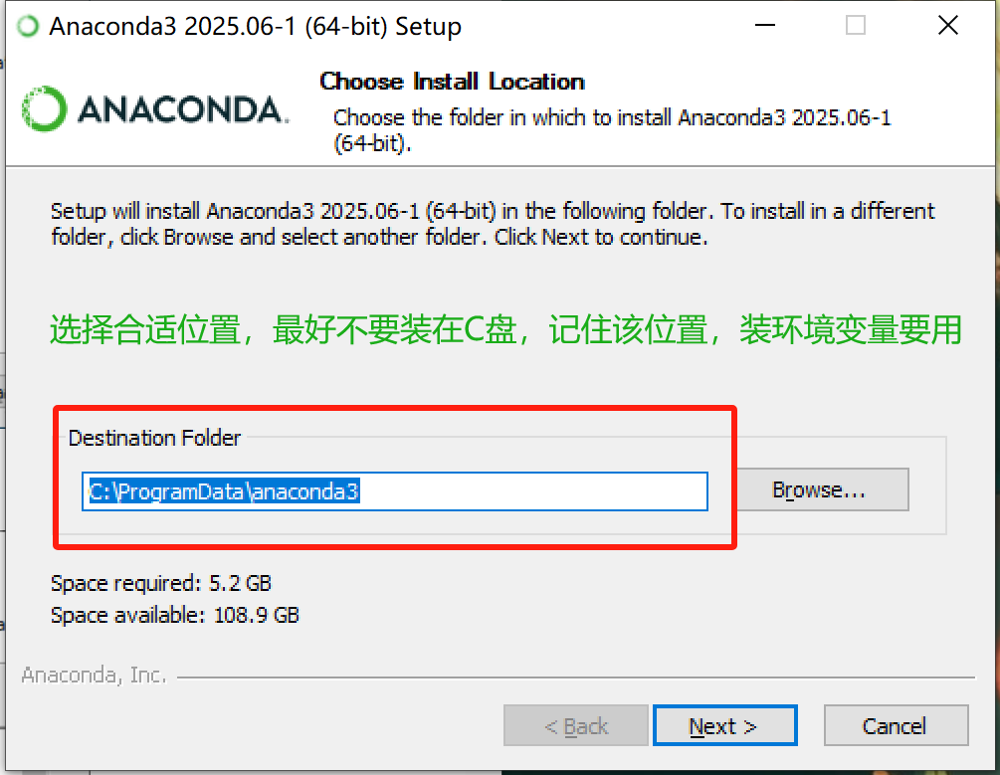

## 若已安装Python则不需要勾选二，三可选可不选

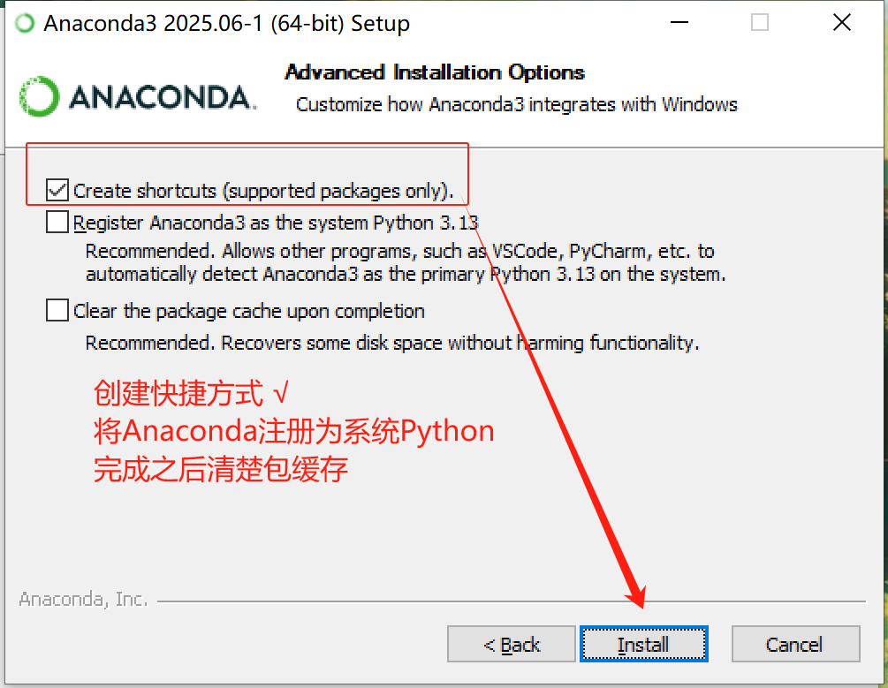

## 这一步等待时间较长

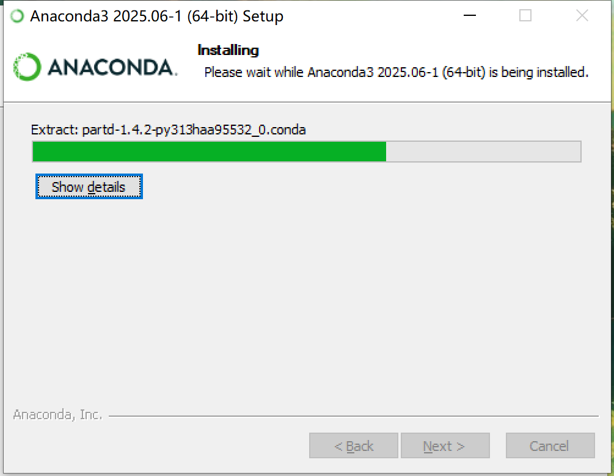

## 安装完成Next

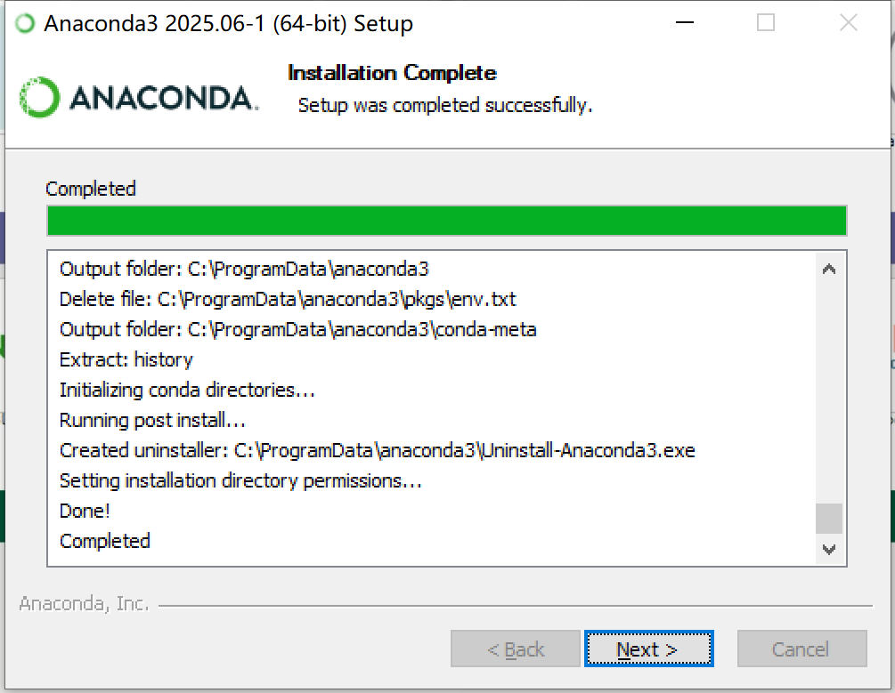

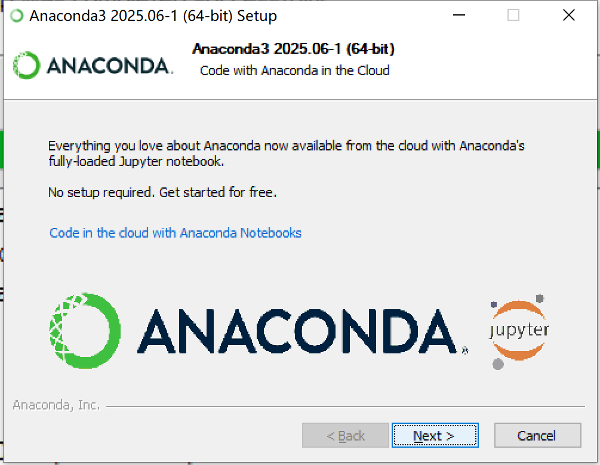

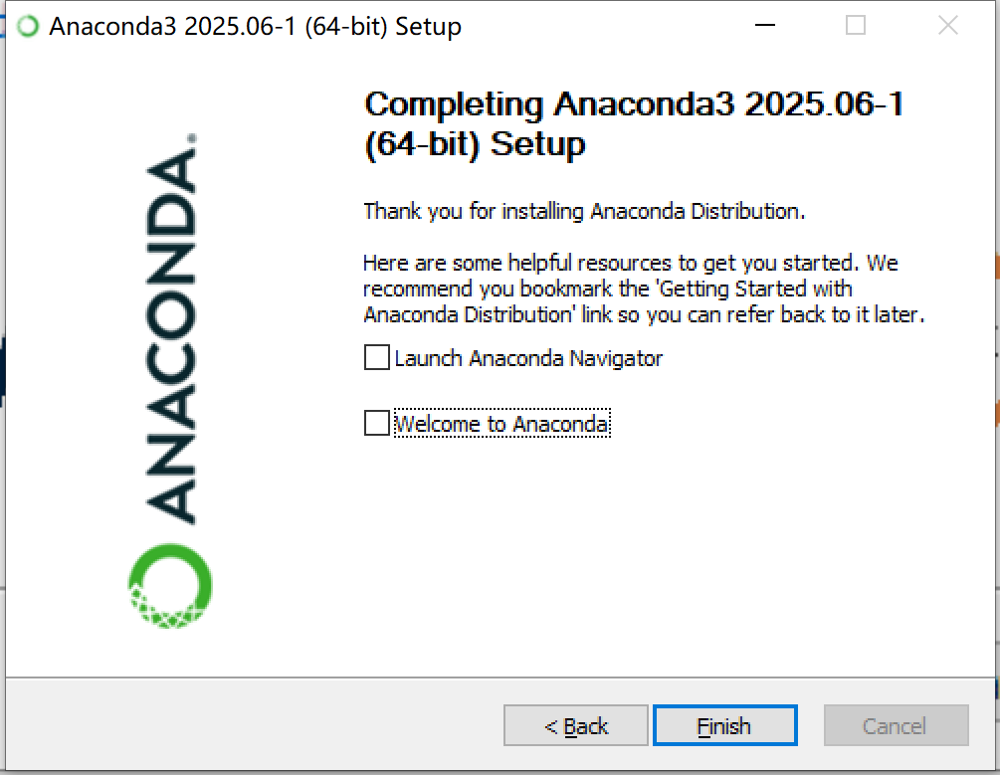

## 打开Anaconda prompt

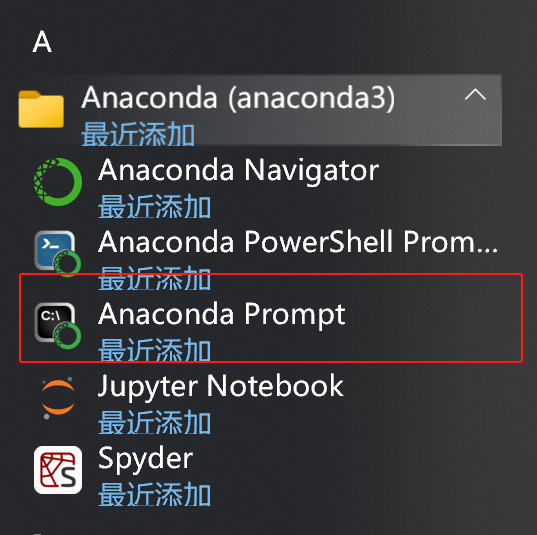

## Step2 配置国内源（在安装完成的Anaconda prompt中执行，若安装的是miniconda，则需要使用conda init初始化conda终端,在终端中执行）

```powershell
conda config --add channels https://mirrors.tuna.tsinghua.edu.cn/anaconda/pkgs/free/
conda config --add channels https://mirrors.tuna.tsinghua.edu.cn/anaconda/pkgs/main/
conda config --set show_channel_urls yes
```

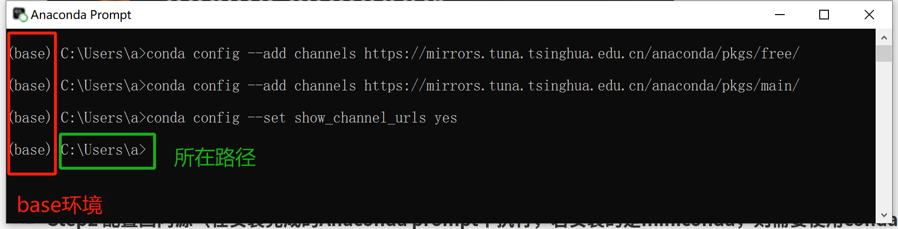

# Step3 配置环境变量（有版本的anaconda还需要配置Library\mingw-w64\bin）

```powershell
%CONDA_HOME%
%CONDA_HOME%\Scripts
%CONDA_HOME%\Library\bin
```

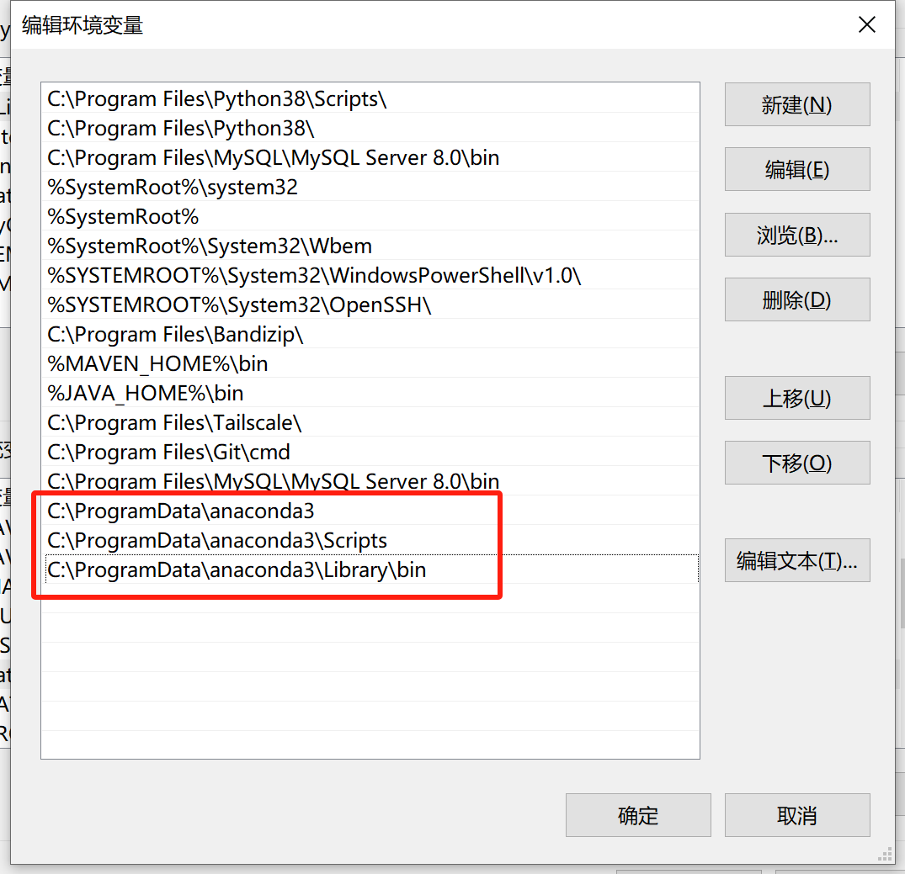

# Step4  验证是否配置成功

```powershell
conda --version
```

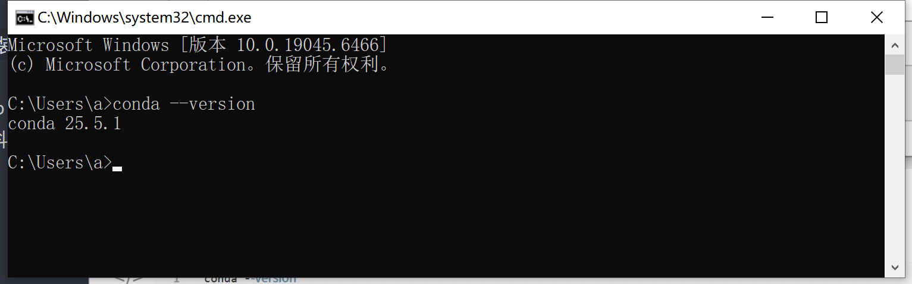

# Step5 修改包的保存路径并验证

    默认情况下，Anaconda下载的包会保存在 C:\Users\用户名\目录下，这可能会占用大量C盘空间，建议将其修改到其他磁盘路径，例如E:\anaconda
D:\Anaconda.更改保存路径在.condarc文件中修改，该文件在C盘/用户/用户名下，找到该文件后用记事本打开，输入以下内容:

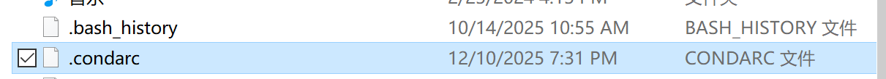

```yaml

envs_dirs:
   	- E:\Anaconda\envs
pkgs_dirs:
	- E:\Anaconda\pkgs
```

验证配置：打开 Anaconda Prompt，输入conda info 验证配置是否成功。

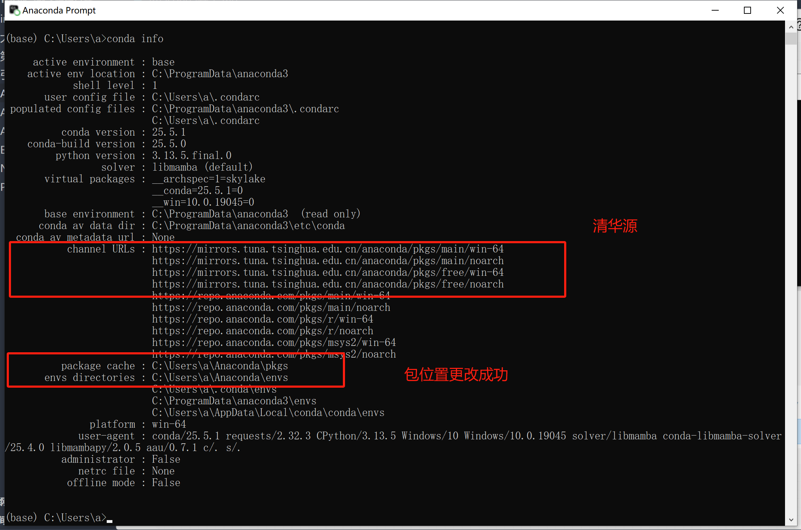

