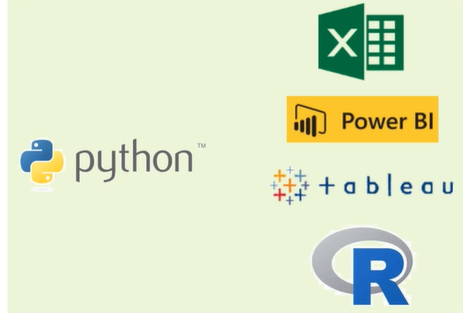
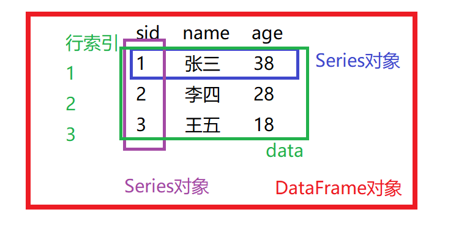
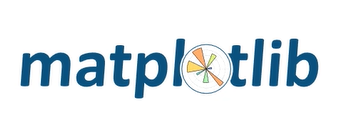

# Python数据分析入门

## 引言

### 为什么使用Python

使用Python语言进行数据分析的优势

- 可以独立完成数据分析的各种任务（数据加载 =》 数据预处理 =》统计分析 =》导出=》结果展示）
- 数据分析领域里有海量开源库
- 机器学习/深度学习领域最热门的编程语言
- 在爬虫，Web开发等领域均有应用

与Excel，PowerBI，Tableau等软件比较

- Excel有百万行数据限制
- PowerBI，Tableau在处理大数据的时候速度相对较慢
- Excel，PowerBI 和Tableau需要付费购买授权
- Python功能远比Excel，PowerBI，Tableau等软件强大
- Python跨平台，Windows，Mac0S，Linux都可以运行

与R语言比较(R语言，更侧重于做数据分析的统计分析领域)

- Python在处理海量数据的时候比R语言效率更高
- Python的工程化能力更强，R专注于统计与数据分析领域
- Python在非结构化数据(文本，图像)和深度学习领域比R更有优势
- 在数据分析相关开源社区，python相关的内容远多于R语言

**总之，Python在数据分析领域简单易学，开源免费，功能强大**

### Python数据分析开源库介绍

#### NumPy

    NumPy(Numerical Python)是Python 语言的一个扩展程序库，是一个运行速度非常快的数学库，主要用于数组计算（即矩阵运算）	，Pandas底层依赖NumPy。

> NumPy 是 Python 科学计算的“发动机”。它把 C 和 Fortran 级的高性能数组运算藏在幕后，让向量化计算像开平方一样瞬间完成；又把广播、掩码、线性代数、傅里叶变换等数学利器封装成一行代码，三分钟导入，三秒钟跑通。切片、变形、随机流、掩码数组……所有 MATLAB 能做的事，NumPy 用更轻量的语法一次性搞定，还额外附赠内存视图、硬件加速、跨平台零依赖。从笔记本上的 4×4 实验到 GPU 集群的 TB 级仿真，同一套 ndarray 零成本切换——这就是 NumPy 成为数值计算“通用货币”的原因：接口薄、速度猛、生态深。

**主要数据结构及功能：**

- 一个强大的N维数组对象ndarray（n dimension array）
- 广播功能函数
- 整合 C/C++/Fortran 代码的工具
- 线性代数、傅里叶变换、随机数生成等功能

#### Pandas

    Pandas是一个强大的分析结构化数据的工具集,它的使用基础是Numpy(提供高性能的矩阵运算)。该库主要用于数据挖掘和数据分析，同时也提供数据清洗功能。

>  Pandas 是 Python 在数据科学领域的“瑞士军刀”。它把 C 级加速的 NumPy 引擎藏在幕后，让海量数据像 Excel 一样秒开秒算；又把缺失值、时间序列、类别型数据等真实世界的“脏活”封装成一两行代码，五分钟写完，五分钟跑通。分组、聚合、透视、窗口函数、向量化字符串……所有 SQL 能做的事，Pandas 用更直观的语法一次性搞定，还额外附赠可视化、内存压缩、并行读写等技能。从笔记本上的千行样本到 Hadoop 集群的十亿行日志，同一套 API 零成本切换——这就是 Pandas 成为数据分析与大数据开发“通用货币”的原因：代码短、思路直、跑得飞快。

**主要数据结构：**

- Series，是一种类似于一维数组的对象
- DataFrame，是Pandas中的一个表格型的数据结构

#### Matplotlib

    Matplotlib是一个功能强大的数据可视化开源Python库，也是Python中使用最多的图形绘图库，它可以创建静态，动态和交互式的图表。

> Matplotlib 是 Python 可视化世界的“素描本”。它把 Anti-Grain Geometry 的高性能渲染引擎藏在幕后，让千万点折线图像刷新桌面一样秒开秒画；又把线型、色盘、子图、3D 投影、LaTeX 公式等出版级细节封装成几行代码，五分钟写完，五秒钟出图。折线、柱状、等高线、极坐标、动画……所有 Origin 能做的事，Matplotlib 用更自由的语法一次性搞定，还额外附赠矢量输出、交互小部件、后端切换等技能。从论文里的 2 cm 插图到幕墙上的 4K 大屏，同一套 API 零成本缩放——这就是 Matplotlib 成为科研与工程绘图“通用货币”的原因：控制细、输出稳、样式全。

#### Seaborn

    Seaborn是一个Python数据可视化开源库，该库建立在matplotlib之上，并集成了pandas的数据结构Seaborn通过更简洁的API来绘制信息更丰富，更具吸引力的图像面向；Seaborn存在面向数据集的API，与Pandas配合使用起来比直接使用Matplotlib更方便

> Seaborn 是 Python 可视化界的“调色盘”。它把 Matplotlib 的硬核画布藏在幕后，让统计颜值像滤镜一样一键升级；又把线性回归、分布拟合、分面网格、色觉友好调色板等复杂统计绘图封装成一行代码，三分钟导入，三秒钟出片。箱线、提琴、热力图、聚类树、联合网格……所有 ggplot2 能做的事，Seaborn 用更简洁的语法一次性搞定，还额外附赠自动标注、置信区间、主题一键换肤等技能。从探索性分析的草图到汇报 PPT 的封面，同一套 API 零成本切换——这就是 Seaborn 成为统计可视化“通用货币”的原因：代码少、颜值高、含义清。

#### Sklearn

    scikit-learn是基于Python语言的机器学习工具库。也是一种简单高效的数据挖掘和数据分析工具，这个库可供大家在各种环境中重复使用；该库建立在建立在 NumPy，SciPy和matplotlib上

> Scikit-learn 是 Python 机器学习的“万能扳手”。它把 Cython 加速的数值算法藏在幕后，让模型训练像调音量一样瞬间完成；又把预处理、特征工程、交叉验证、网格搜索、管道式编程等工业级流程封装成两三行代码，五分钟写完，五秒钟跑通。分类、回归、聚类、降维、异常检测……所有 R  caret 能做的事，Scikit-learn 用更一致的 API 一次性搞定，还额外附赠模型持久化、并行调度、可解释性报告等技能。从笔记本上的 1 万行样本到 Spark 集群的亿级特征，同一套 estimator 零成本迁移——这就是 Scikit-learn 成为机器学习“通用货币”的原因：接口统一、文档良心、生态霸榜。

#### Jupyter Notebook/Jupyter Lab（Jupyter Lab更底层一些，Notebook可看成Lab的封装）

    Jupyter Notebook是一个开源Web应用程序，可以创建和共享代码、公式、可视化图表、笔记文档。这个IDE是数据分析学习和开发的首选开发环境。

**用途：**

- 数据清理和转换
- 数值模拟
- 统计分析
- 数据可视化
- 机器学习等
