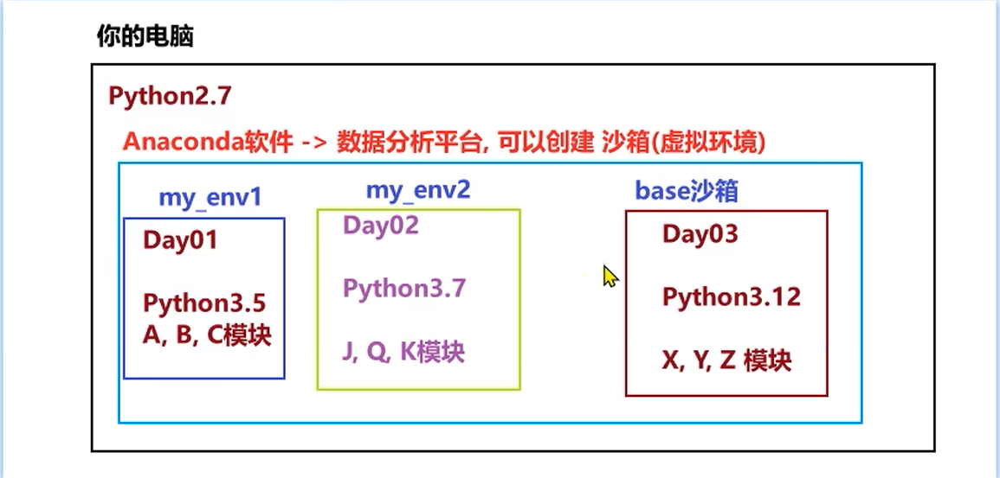
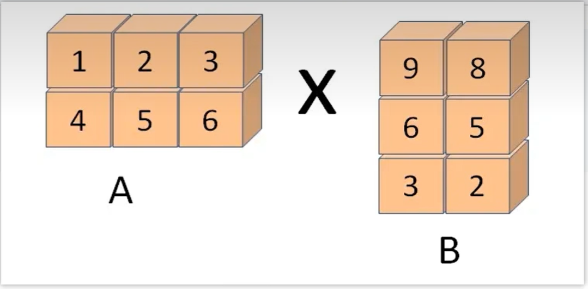
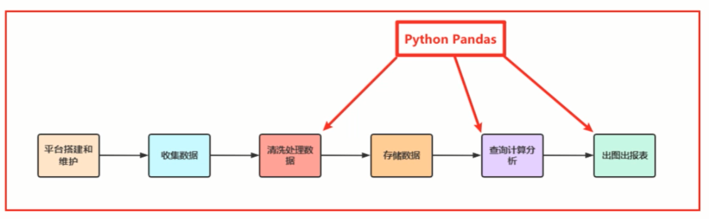

[课程大纲](pdf/Python数据科学与建模算法初步(教学大纲).pdf)
# Python数据分析环境搭建与环境管理命令

## Anaconda

    Anaconda 是最流行的数据分析平台，全球两千多万人在使用。Anaconda附带了一大批常用数据科学包，在conda(一个包管理器和环境管理器)的基础上发展出来的，可以帮助你在计算机上安装和管理数据分析相关包的包含了虚拟环境(沙箱)管理的工具。

[Anaconda安装](pdf/Anaconda安装.pdf)

## Anaconda的常用包管理命令

[what is conda](https://www.anaconda.com/docs/getting-started/concepts/what-is-conda)

```powershell
conda pip install 包名字
```

注意，使用pip时最好指定安装源:

- 阿里云:https://mirrors.aliyun.com/pypisimple/
- 豆瓣:https://pypi.douban.com/simple/cn/simple/
- 清华大学:https://pypi.tuna.tsinghua.edu
- 中国科学技术大学 http://pypi.mirrors.ustc.edu.cn/simple/

```powershell
pip install 包名-i https://mirrrs.aliyun.com/pypi/simple/
```

## Anaconda 虚拟环境（沙箱）

虚拟环境的作用

- 很多开源库版本升级后API有变化，老版本的代码不能在新版本中运行
- 将不同Python版本/相同开源库的不同版本隔离
- 不同版本的代码在不同的虚拟环境中运行

```powershell
conda create -n 虚拟环境名字 python=python版本 # 不指定默认使用base python版本
conda activate 虚拟环境名字 
conda deactivate 虚拟环境名字
conda remove -n 虚拟环境名字 --all
conda env list
conda list 模块名 #查看虚拟环境是否安装该模块
conda search 模块名 # 查看是否有合适的该模块可安装
```

[常见操作命令](pdf/Anaconda环境管理常用命令.pdf)
[Jupyter Notebook连接conda创建的虚拟环境](pdf/Jupyter Notebook连接conda环境.pdf)

# 第一讲 数据处理

## 数据处理核心：Numpy

### 简介

    NumPy(Numerical Python)是Python数据分析必不可少的第三方库,NumPy的出现一定程度上解决了Python运算性能不佳的问题，同时提供了更加精确的数据类型，使其具备了构造复杂数据类型的能力。本身是**由C语言开发**，是个很基础的扩展，NumPy被Python其它科学计算包作为基础包，因此理解np的数据类型对python数据分析十分重要。NumPy重在数值计算，主要用于多维数组(矩阵)处理的库。用来存储和处理大型矩阵，比Python自身的嵌套列表结构要高效的多

Numpy重要功能：

- 高性能科学计算和数据分析的基础包
- ndarray，多维数组，具有矢量运算能力，快速、节省空间
- **矩阵运算**，无需循环，可完成类似Matlab中的矢量运算
- 用于读写磁盘数据的工具以及用于操作内存映射文件的工具

### Numpy 属性

    NumPy的数组类（源自C）被称作ndarray，通常被称作矩阵。矩阵的维度。这是一个指示矩阵在每个维度上大小的整数元组。例如一个n排m列的矩阵，它的shape属性将是(2,3),这个元组的长度显然是秩，即维度或者ndim属性

ndarray对象属性:

- ndim(维度，几层嵌套)
- shape(形状，几行几列)
- size(大小，几个元素)
- dtype(datatype,元素的类型)
- itemsize(元素的大小，在计算机中占几个字节)

```python
import numpy as np

a = np.arange(15).reshape(3, 5) 

# arange,生成一维矩阵
print('矩阵形状:', a.shape)
print('矩阵维数：', a.ndim)
print('矩阵元素类型:', a.dtype)
print('矩阵元素大小:', a.itemsize)
print('矩阵大小:', a.size)
print('矩阵类型:', type(a))

```

### ndarray

    NumPy数组是一个多维的数组对象(矩阵)，称为ndarray，具有矢量算术运算能力和复杂的广播能力，并具有执行速度快和节省空间的特点。**注意:ndarray的下标从0开始，且数组里的所有元素必须是相同类型。**

- array() Python列表 =》 ndarray对象

```python
import numpy as np
a = np.array([2，3，4])
print("数组a元素类型:",a)
print("数组a类型:", a.dtype)

b = np.array([1.2，3.5，5.1])
print("数组b元素类型:", b.dtype)
```

- arange(), 类似python的range()，创建一个一维 ndarray 数组。

```python
np_arange =np.arange(10, 20, 5, dtype=int)
print("arange创建np_arange:", np_arange)
print("arange创建np_arange的元素类型:", np_arange.dtype)
print("arange创建np_arange的类型:", type(np_arange))
```

- 创建随机数矩阵

  - np.random.rand(x, y)
    - 生成指定维度大小(x行y列)的随机多维浮点型数据(二维)，rand固定区间0.0 ~ 1.0
  - np.random.randint(start, end, size = (x, y))
    - 生成指定维度大小(x行y列)的随机多维整型数据(二维)，randint可以指定区间(start，end)产生start到end之间整数
  - np.random.uniform(start, end, size = (x, y))
    - 生成指定维度大小(x行y列)的随机多维浮点型数据(二维),uniform可以指定区间(start，end)产生start到end之间小数

  ```python
  import numpy as np
  arr = np.random.rand(3，4) 
  print(arr)
  print(type(arr)) 

  arr = np.random.randint(-1，5，size=(3，4))
  print(arr)
  print(type(arr))

  arr =np.random.uniform(-1，5，size=(3，4))
  print(arr)
  print(type(arr))
  ```
- numpy的类型转换astype()

  ```python

  zeros_float_arr = np.zeros((3,4),dtype=np.float64)
  print(zeros_float_arr)
  print(zeros_float_arr.dtype) #float64

  zeros_int_arr = zeros_float_arr.astype(np.int32)
  print(zeros_int_arr)
  print(zeros_int_arr.dtype) #int32
  ```
- 等比和等差数列

  - np.logspace(start, end, num, base)

    **注：logspace中，开始点和结束点是10的幂(base默认10)，返回等比一维矩阵,元素个数默认为浮点型**

    ```python
    a = np.logspace(0, 0, 10)
    a
    ```

    ```python
    a = np.logspace(0, 9, 10, base = 2)
    a
    ```
  - np.linspace(start, end, num)

    np.linspace创建一维矩阵，并且是等差数列构成的一维矩阵
    **注：linspace创建的数组元素是浮点型,可以使用参数endpoint来决定是否包含终止值，默认值为True。**

    ```python
    a = np.linspace(1, 10, 10)
    a
    ```

    ```python
    np.linspace(1,10,10,endpoint=False)
    a
    ```

### Numpy内置函数

大多数内置函数的参数可以是数据或者ndarray

## 基本函数

| 函数名            | 功能描述                               |
| :---------------- | :------------------------------------- |
| `np.ceil()`     | 向上取整，最接近的较大整数             |
| `np.floor()`    | 向下取整，最接近的较小整数             |
| `np.rint()`     | 四舍五入到最接近的整数                 |
| `np.isnan()`    | 判断元素是否为 NaN                     |
| `np.multiply()` | 元素相乘                               |
| `np.divide()`   | 元素相除                               |
| `np.abs()`      | 元素的绝对值                           |
| `np.where()`    | 三元运算符，满足条件返回 x，否则返回 y |

np.random.randn() 返回具有标准正态分布的序列

```python
arr = np.random.randn(2,3)
print(arr)print(np.ceil(arr))
print(np.floor(arr))
print(np.rint(arr))
print(np.isnan(arr))
print(np.multiply(arr, arr))
print(np.divide(arr, arr))
print(np.where(arr>0，1，-1))
```

其中矩阵对应数相乘若行列数一致，直接写成arr1 * arr1

## 统计函数


| 函数名           | 功能描述                                           |
| :--------------- | :------------------------------------------------- |
| `np.mean()`    | 所有元素的平均值                                   |
| `np.sum()`     | 所有元素的和                                       |
| `np.min()`     | 所有元素的最小值                                   |
| `np.max()`     | 所有元素的最大值                                   |
| `np.var()`     | 所有元素的方差                                     |
| `np.std()`     | 所有元素的标准差                                   |
| `np.argmin()`  | 最小值的下标索引值                                 |
| `np.argmax()`  | 最大值的下标索引值                                 |
| `np.cumsum()`  | 返回一个一维数组，每个元素都是之前所有元素的累加和 |
| `np.cumprod()` | 返回一个一维数组，每个元素都是之前所有元素的累乘积 |

**注意：若输入参数多维数组默认统计全部维度，axis参数可以按指定轴心统计，值为0则按列统计，值为1则按行统计(pandas里面不太一样，实际使用时需要测试一下)**

## 去重函数

np.unique():找到唯一值并返回排序结果，类似于Python的set集合

```python
arr = np.array([[1, 2, 1], [2, 3, 4]])
print(arr)
print(np.unique(arr))
```


## 排序函数

np.sort()函数排序，返回的是排序后的副本

ndarray直接调用sort,在原数据上进行修改

```python
arr = np.array([1, 2, 34,5])
print("原数组arr:", arr)


sortarr = np.sort(arr)
print("排序后的矩阵:", sortarr)

arr.sort()
print("矩阵.sort()方法排序:", arr)
```

## Numpy运算

### 基本运算

矩阵的算数运算是按照元素的。新的数组被创建并且被结果填充

```python
a = np.array([20, 30, 40, 50])
b = np.arange(4)
c = a - b
print(f'数组a:{a}')
print(f'数组b:{b}')
print(f'数组c:{c}')
```

### 矩阵乘法（点积）

矩阵乘法存在shape要求，(a, b) @ (b, c) => (a, c),若第一个矩阵的列数不等于第二个矩阵的行数，则报错



```python
x = np.array([[1, 2, 3], [4, 5, 6]])
y = np.array([[6, 23], [-1, 7], [8, 9]])

print(x, y, sep = '\n')
print(x.dot(y))
print(np.dot(x, y))
```

## 数据处理利器：Pandas

    Python的Pandas包，无论是在数据分析领域、还是大数据开发场景中都具有显著的优势。作为Python的第三方包，也是商业和工程领域最流行的结构化数据工具集，在**数据清洗、处理以及分析，结果展示**方面功能强大。



Pandas在数据处理的独特优势：

- 底层是基于Numpy构建的，所以运行速度特别的快
- 有专门的处理缺失数据的API
- 强大而灵活的分组、聚合、转换功能


