# 数学基础

## 高等数学

### 导数

1. 概念

    导数(derivative)是微积分中的一个概念。函数在某一点的导数是指这个函数在这一点附近的变化率(即函数在这一点的切线斜率)。导数的本质是通过极限的概念对函数进行局部的线性逼近。

    当函数$f$的自变量在一点$x_0$。上产生一个增量$h$时，函数输出值的增量$\Delta{y}$与自变量增量$\Delta{x}$的比值在$\Delta{x}$趋于0时的极限如果存在,即为$f$在$x_0$处的导数,记作$f^{\prime}(x_0)$、$\frac{\mathrm{d} f(x_0)}{\mathrm{d} x}$。

$$
f'(x_0)=\lim_{\Delta x \to 0}\frac{f(x_0+\Delta x)-f(x_0)}{\Delta x}
$$

2. 常见导数公式

| 说明               | 公式                                                                                                                                            | 例子                             |
| ------------------ | ----------------------------------------------------------------------------------------------------------------------------------------------- | -------------------------------- |
| 常数的导数         | $(C)'=0$                                                                                                                                      | $(3)'=0$                       |
| 幂函数的导数       | $(x^a)'=ax^{a-1}$                                                                                                                             | $(x^3)'=3x^2$                  |
| 指数函数的导数     | $(a^x)'=a^x\ln a$                                                                                                                             | $(3^x)'=3^x\ln 3$              |
| 自然指数函数的导数 | $(e^x)'=e^x$                                                                                                                                  |                                  |
| 对数函数的导数     | $(\log_a x)'=\frac{1}{x\ln a}$                                                                                                                | $(\log_3 x)'=\frac{1}{x\ln 3}$ |
| 三角函数的导数     | $(\sin x)'=\cos x$<br />$(\cos x)'=-\sin x$<br />$(\tan x)'=\sec^2 x=\frac{1}{\cos^2 x}$<br />$(\cot x)'=-\csc^2 x=-\frac{1}{\sin^2 x}$ |                                  |

3. 求导法则

| 说明           | 公式                                                 |
| -------------- | ---------------------------------------------------- |
| 两函数之和求导 | $(f+g)'=f'+g'$                                     |
| 两函数之积求导 | $(fg)'=f'g+fg'$                                    |
| 两函数之商求导 | $\left(\frac{f}{g}\right)'=\frac{f'g-fg'}{g^2}$    |
| 复合函数的导数 | 若$f(x)=h[g(x)]$，则 $f'(x)=h'[g(x)]\cdot g'(x)$ |

4. 利用导数求极值

   导数等于零的点称为函效的驻点(或极值可疑点)，在这类点上函数可能会取得极大值或极小值。进一步判断则需要知道导数在附近的符号。

   例如，$f(x)=x^3$ 在$x=0$处导数为 $0$ ，但并不会取得极大值或者极小值。


5. 二阶导数

> 概念

    在微积分中，函数的二阶导数是函数导数的导数。粗略来说，某个量的二阶导数描述该量变化率变化的快慢。例如物体位置对时间的二阶导数是物体的瞬时加速度，即该物体速度对时间的变化率:$a = \dfrac{dv}{dt} = \dfrac{{d^{2}s}}{dt}$

用数学符号表示，若位置函数为 $s(t)$，则
速度 $v(t) = \dfrac{ds}{dt}$，
加速度 $a(t) = \dfrac{dv}{dt} = \dfrac{d^{2}s}{dt^{2}}$。

> 二阶导数与函数凹凸的关系

    函数的二阶导数描述了函数图像的凹凸方向和程度。若二阶导数在某区间恒为正，则函数在该区间向上弯(也称下凸函数)。反之，若二阶导数在某区间恒为负，则函数在该区间向下弯(也称上凸函数)


    若函数的二阶导数在某点左右异号，则图像由向上弯转为向下弯，或反之。这种点称之为**拐点**。若二阶导数连续，则在该点处二阶导数为 $0$。但反之二阶导数为 $0$ 的点不一定是拐点。例如 $f(x)=x^4$，在 $x=0$ 处有 $f''(0)=0$，但 $f(x)$ 在实数系上无拐点。


二阶导数与凹凸性的关系有助于判断函数的驻点是否为极大值点或极小值点：

- 若 $f'(x)=0$，$f''(x)<0$，则 $f$ 在 $x$ 取得极大值。
- 若 $f'(x)=0$，$f''(x)>0$，则 $f$ 在 $x$ 取得极小值。
- 若 $f'(x)=0$，$f''(x)=0$，则该点可能是拐点，也可能是极大值点或极小值点，需进一步分析。

### 偏导数与梯度

> 偏导数

    如果函数的自变量并非单个元素，而是多个元素，例如：

$$
f(x,y)=x^2+xy+y^2
$$


可将其中一个元素$x$ 视作常数，此时 $f$ 可看作关于另一元素 $y$ 的函数：

$$
f(y)=x^2+xy+y^2
$$

    在$x=a$ 固定的情况下，可计算 $f$ 关于 $y$ 的导数：

$$
\frac{\partial f}{\partial y}=x+2y
$$

    这种导数称为偏导数，一般记作：

$$
\frac{\partial f}{\partial y}(x,y)=x+2y
$$

    更一般地来说，一个多元函数$f(x_1,x_2,\dots,x_n)$ 在点 $(a_1,a_2,\dots,a_n)$ 处对 $x_i$ 的偏导数定义为：

$$
\frac{\partial f}{\partial x_i}(a_1,a_2,\dots,a_n)=\lim_{\Delta x_i\to0}\frac{f(a_1,\dots,a_i+\Delta x_i,\dots,a_n)-f(a_1,\dots,a_i,\dots,a_n)}{\Delta x_i}
$$

方向导数

    **偏导数可以看作是多元函数$f$ 沿某个自变量轴方向的变化率。**
    如果我们**任意选取一个方向$\boldsymbol{l}$**，那么在某个点 $(x_0,y_0)$ 处，二元函数 $f(x,y)$ 沿着这个方向的变化率可以用极限定义为：

$$
\frac{\partial f}{\partial\boldsymbol{l}}(x_0,y_0)=\lim_{\Delta l\to 0}\frac{f(x_0+\Delta x,\,y_0+\Delta y)-f(x_0,y_0)}{\Delta l}
$$

    这里，$\Delta l$ 就是沿方向 $\boldsymbol{l}$ 的微小改变量，$\Delta x$ 和 $\Delta y$ 与 $\Delta l$ 的关系为：

$$
\Delta x=\Delta l\cdot\cos\alpha,\quad \Delta y=\Delta l\cdot\cos\beta
$$

    其中$\alpha,\beta$ 为方向 $\boldsymbol{l}$ 与 $x$ 轴、$y$ 轴的夹角。


根据全微分公式，上式可以表示为

$$
\frac{\partial f}{\partial\boldsymbol{l}}(x_0,y_0)
= f_x(x_0,y_0)\cos\alpha + f_y(x_0,y_0)\cos\beta
$$

    其中$f_x(x_0,y_0)$、$f_y(x_0,y_0)$ 表示点 $(x_0,y_0)$ 处对 $x$、$y$ 的偏导数；$\cos\alpha$、$\cos\beta$ 是方向 $\boldsymbol{l}$ 的方向余弦，即 $\boldsymbol{l}$ 方向的单位方向向量可以表示为 $\boldsymbol{l}_0=(\cos\alpha,\cos\beta)$。
	这个“沿某个方向的变化率”，就被称为 $f(x,y)$ 沿方向 $\boldsymbol{l}$ 的**方向导数**。

> 梯度

多元函数 $f(x_1,\dots,x_n)$ 关于每个变量都有偏导数，在点 $\boldsymbol{a}=(a_1,a_2,\dots,a_n)$ 处，这些偏导数定义出一个向量：

$$
\nabla f(\boldsymbol{a})=
\begin{pmatrix}
\dfrac{\partial f}{\partial x_1}(\boldsymbol{a}),&
\dfrac{\partial f}{\partial x_2}(\boldsymbol{a}),&
\dots,&
\dfrac{\partial f}{\partial x_n}(\boldsymbol{a})
\end{pmatrix}^{\!\top}
$$

这个**向量**称为在点 $\boldsymbol{a}$ 的**梯度**，记作 $\nabla f(\boldsymbol{a})$ 或者 $\operatorname{grad} f(\boldsymbol{a})$。

例如：$f(x,y)=x^2+xy+y^2$ 在 $(1,1)$ 处的梯度为

$$
\nabla f(1,1)=
\begin{pmatrix}
3, 3
\end{pmatrix}
$$


    ***梯度向量表示的方向，就是函数在这一点处，方向导数取最大值的方向。换句话说，梯度的方向，就是函数值变化最快的方向。使损失函数变小，取负梯度方向***

## 线性代数

### 标量与向量

> 概念

1. 标量(scalar)

   标量是一个单独的数，只有大小。
2. 向量(vector)

   向量由标量组成，有大小有方向。

   行向量：$(2\quad5\quad8)$

   列向量：

$$
\begin{pmatrix}
2\\
5\\
8
\end{pmatrix}
$$

> 向量运算

1. 向量转置:列向量转置结果为行向量

   $$
   \mathbf x=\begin{pmatrix}2\\5\\8\end{pmatrix}
   $$

   $$
   \mathbf x^\top=(2\quad5\quad8)
   $$
2. 向量相加：对应元素相加

   $$
   \begin{pmatrix}2\\5\\8\end{pmatrix}+\begin{pmatrix}1\\3\\7\end{pmatrix}=\begin{pmatrix}3\\8\\15\end{pmatrix}
   $$
3. 向量与标量相乘：标量与向量每个元素相乘

$$
3\times \begin{pmatrix}2\\5\\8\end{pmatrix} = \begin{pmatrix}6\\15\\24\end{pmatrix}
$$

4. 向量内积，又称向量点乘，两向量对应元素乘积之和，结果未标量

   $$
   (\mathbf x,\mathbf y)=(\mathbf {\begin{pmatrix}2\\5\\8\end{pmatrix}},\mathbf {\begin{pmatrix}1\\3\\7\end{pmatrix}})=2+15+56=73
   $$

   两向量之间夹角表示为

   $$
   \cos\theta=\frac{(\mathbf x,\mathbf y)}{\sqrt{(\mathbf x,\mathbf x)}\sqrt{(\mathbf y,\mathbf y)}}
   =\frac{\mathbf x\cdot\mathbf y}{\|\mathbf x\|\|\mathbf y\|}.
   $$

   > 向量范数(norm)
   >

   范数(norm)是具有“长度”概念的函数。范数满足：非负性(正定性)，齐次性(乘上系数可以拿出来)，满足三角不等式

1）L₀ 范数（也称 0 范数）

$$
\|\mathbf x\|_0 = \text{非零元素的个数}
$$

例如：

$$
\mathbf x = \begin{pmatrix}0\\2\\-1\end{pmatrix}, \quad \|\mathbf x\|_0 = 2
$$

2）L₁ 范数（也称和范数或 1 范数,曼哈顿距离）

$$
\|\mathbf x\|_1 = \sum_{i=1}^n |x_i| = |x_1| + \dots + |x_n|
$$

例如：

$$
\mathbf x = (0, -2, 1), \quad \|\mathbf x\|_1 = 0 + 2 + 1 = 3
$$

3）L₂ 范数（也称欧几里得范数或 2 范数，欧几里得距离）

$$
\|\mathbf x\|_2 = \sqrt{\sum_{i=1}^n |x_i|^2} = \sqrt{|x_1|^2 + \dots + |x_n|^2}
$$

例如：

$$
\mathbf x = (0, -2, 1), \quad \|\mathbf x\|_2 = \sqrt{0 + 4 + 1} = \sqrt{5}
$$

4）$L_p$ 范数

$$
\|\mathbf x\|_p = \left(\sum_{i=1}^n |x_i|^p\right)^{1/p} = \left(|x_1|^p + \dots + |x_n|^p\right)^{1/p}
$$

在 NumPy 中，可以利用 `linalg.norm` 函数方便地计算向量的范数。

### 矩阵

> 矩阵的概念

一个 $m\times n$ 的矩阵（matrix）是一个有 $m$ 行 $n$ 列元素的矩形阵列。用 $\mathbb R^{m\times n}$ 表示所有 $m\times n$ 实数矩阵的向量空间。

$$
\begin{bmatrix}
1 & 2 \\ 3 & 5 \\ 4 & 8
\end{bmatrix}
\in\mathbb R^{3\times2}
$$

1）方阵：行数等于列数的矩阵

$$
\begin{bmatrix}
1 & 2 \\ 3 & 4
\end{bmatrix}
\in\mathbb R^{2\times2}
$$

2）对角矩阵：主对角线以外元素全为 $0$ 的方阵

$$
\begin{bmatrix}
1 & 0 & 0 \\
0 & 5 & 0 \\
0 & 0 & 9
\end{bmatrix}
$$

3）单位矩阵：主对角线元素全为 $1$ 的对角矩阵

$$
\mathbf I_{3\times3}=
\begin{bmatrix}
1 & 0 & 0 \\
0 & 1 & 0 \\
0 & 0 & 1
\end{bmatrix}
$$

> 矩阵乘法

1）矩阵乘法运算
    两个矩阵的乘法仅当矩阵$A$ 的列数和矩阵 $B$ 的行数相等时才能定义。如 $A\in\mathbb R^{m\times n}$，$B\in\mathbb R^{n\times p}$，它们的乘积 $AB\in\mathbb R^{m\times p}$。

$$
[AB]_{ij}=a_{i1}b_{1j}+a_{i2}b_{2j}+\dots+a_{in}b_{nj} = \sum\limits_{r=1}^{n} a_{ik}b_{kj}
$$

例如：

$$
\begin{bmatrix}
1 & 0 & 2 \\
-1 & 3 & 1
\end{bmatrix}
\begin{bmatrix}
3 & 1 \\
2 & 1 \\
1 & 0
\end{bmatrix}
=
\begin{bmatrix}
1\times3+0\times2+2\times1 & 1\times1+0\times1+2\times0 \\
-1\times3+3\times2+1\times1 & -1\times1+3\times1+1\times0
\end{bmatrix}
=
\begin{bmatrix}
5 & 1 \\
4 & 2
\end{bmatrix}
$$

特别地，矩阵与单位矩阵相乘等于矩阵本身：

$$
A\mathbf I=A\quad (A\in\mathbb R^{m\times n},\;\mathbf I\in\mathbb R^{n\times n})
\quad\text{或}\quad
\mathbf I A=A\quad (\mathbf I\in\mathbb R^{n\times n},\;A\in\mathbb R^{n\times m})
$$

例如：

$$
\begin{bmatrix}
1 & 2 \\
4 & 5 \\
7 & 8
\end{bmatrix}
\begin{bmatrix}
1 & 0 \\
0 & 1
\end{bmatrix}
=
\begin{bmatrix}
1\times1+2\times0 & 1\times0+2\times1 \\
4\times1+5\times0 & 4\times0+5\times1 \\
7\times1+8\times0 & 7\times0+8\times1
\end{bmatrix}
=
\begin{bmatrix}
1 & 2 \\
4 & 5 \\
7 & 8
\end{bmatrix}
$$

2）矩阵乘法的性质
	矩阵乘法满足结合律、左分配律和右分配律，不满足交换律，即 $AB\neq BA$。

结合律：若 $A\in\mathbb R^{m\times n}$，$B\in\mathbb R^{n\times p}$，$C\in\mathbb R^{p\times q}$，则

$$
(AB)C=A(BC)
$$

左分配律：若 $A\in\mathbb R^{m\times n}$，$B\in\mathbb R^{m\times n}$，$C\in\mathbb R^{n\times p}$，则

$$
(A+B)C=AC+BC
$$

右分配律：若 $A\in\mathbb R^{m\times n}$，$B\in\mathbb R^{n\times p}$，$C\in\mathbb R^{n\times p}$，则

$$
A(B+C)=AB+AC
$$

### 矩阵转置

> 矩阵转置的运算

矩阵 $A\in\mathbb R^{m\times n}$ 的转置是一个 $n\times m$ 的矩阵，记为 $A^\top$。
其中的第 $i$ 个行向量是原矩阵的第 $i$ 个列向量；或者说，转置矩阵 $A^\top$ 第 $i$ 行第 $j$ 列的元素是原矩阵 $A$ 第 $j$ 行第 $i$ 列的元素。

$$
[A^\top]_{ij}=a_{ji}
$$

例如：

$$
A=\begin{bmatrix}
1 & 2 & 3 \\
4 & 8 & 1
\end{bmatrix}\in\mathbb R^{2\times3},\quad
A^\top=\begin{bmatrix}
1 & 4 \\
2 & 8 \\
3 & 1
\end{bmatrix}\in\mathbb R^{3\times2}
$$

> 矩阵转置的性质

$$
\begin{aligned}
&(A^\top)^\top = A \\[2mm]
&(A + B)^\top = A^\top + B^\top \\[2mm]
&(kA)^\top = k A^\top \\[2mm]
&(AB)^\top = B^\top A^\top
\end{aligned}
$$

> 矩阵的逆

对于方阵 $A$，如果存在另一个方阵 $A^{-1}$，使得 $A A^{-1}=I$ 成立，此时 $A^{-1}A=I$ 也同样成立，称 $A^{-1}$ 为 $A$ 的逆矩阵。例如：

$$
A=\begin{bmatrix}
3 & 2 \\[2mm]
5 & 1
\end{bmatrix},\quad
A^{-1}=\frac{1}{3\times 1-2\times 5}
\begin{bmatrix}
1 & -2 \\[2mm]
-5 & 3
\end{bmatrix}
=\begin{bmatrix}
-0.2 & 0.4 \\[2mm]
1.0 & -0.6
\end{bmatrix}
$$

验证：

$$
A A^{-1}=\begin{bmatrix}
3 & 2\\[2mm]
5 & 1
\end{bmatrix}
\begin{bmatrix}
-0.2 & 0.4\\[2mm]
1.0 & -0.6
\end{bmatrix}
=\begin{bmatrix}
1 & 0\\[2mm]
0 & 1
\end{bmatrix}=I
$$

> 其它矩阵运算

1）矩阵的向量化

矩阵 $A\in\mathbb R^{m\times n}$ 的向量化 $\mathrm{vec}(A)$ 将矩阵 $A$ 的元素按列排列成一个 $mn\times 1$ 的向量：

$$
\mathrm{vec}(A)=
\begin{bmatrix}
a_{11}, \dots,a_{m1},a_{1n},\dots,a_{mn}
\end{bmatrix}^T
$$

矩阵也可以转化为行向量 $\mathrm{rvec}(A)$，称为矩阵的行向量化。

$$
\mathrm{rvec}(A)=
\begin{bmatrix}
a_{11},\dots,a_{1n},a_{m1},\dots,a_{mn}
\end{bmatrix}
$$

注意：这两个向量并不是转置的关系

例如：

$$
A=\begin{bmatrix}
1 & 2 \\
3 & 4
\end{bmatrix} \times \begin{bmatrix}
1 & 2 \\
3 & 4
\end{bmatrix} = \begin{bmatrix}
1 & 4 \\
9 & 16
\end{bmatrix}
$$

$$
\mathrm{vec}(A)=
\begin{bmatrix}
1 \\
3 \\
2 \\
4
\end{bmatrix}
$$

$$
\mathrm{rvec}(A)=\bigl(1\quad 2\quad 3\quad 4\bigr)
$$

2）矩阵的内积
矩阵 $A\in\mathbb R^{m\times n}$ 和矩阵 $B\in\mathbb R^{m\times n}$ 的内积记作 $(A,B)$，它是两个矩阵对应元素乘积之和，是一个标量。

$$
(A,B)=\bigl(\mathrm{vec}(A),\mathrm{vec}(B)\bigr)=\sum_{i=1}^m\sum_{j=1}^n a_{ij}b_{ij}
$$

3）矩阵的 Hadamard 积
矩阵 $A\in\mathbb R^{m\times n}$ 和矩阵 $B\in\mathbb R^{m\times n}$ 的 Hadamard 积记作 $A\odot B$，它是两个矩阵对应元素的乘积，是一个 $m\times n$ 的矩阵。

$$
(A\odot B)_{ij}=a_{ij}b_{ij}
$$

4）矩阵的 Kronecker 积
矩阵 $A\in\mathbb R^{m\times n}$ 和矩阵 $B\in\mathbb R^{p\times q}$ 的 Kronecker 积记作 $A\otimes B$，它是矩阵 $A$ 中每个元素与矩阵 $B$ 的乘积，是一个 $mp\times nq$ 的矩阵。

$$
A\otimes B=
\begin{bmatrix}
a_{11}B & a_{12}B & \dots & a_{1n}B\\
a_{21}B & a_{22}B & \dots & a_{2n}B\\
\vdots & \vdots & \ddots & \vdots\\
a_{m1}B & a_{m2}B & \dots & a_{mn}B
\end{bmatrix}
$$

Kronecker积也称为直积或张量积

### 张量(tensor)

    张量（tensor）可视为多维数组，是 1 维向量和 2 维矩阵的$n$ 维推广。
例如：3 维张量

$$
\begin{bmatrix}
\begin{bmatrix}
1 & 2 \\
3 & 5 \\
4 & 8
\end{bmatrix},
\begin{bmatrix}
3 & 2 \\
1 & 6 \\
7 & 3
\end{bmatrix},
\begin{bmatrix}
5 & 6 \\
9 & 1 \\
2 & 4
\end{bmatrix}
\end{bmatrix}
$$

### 矩阵求导

    矩阵求导的本质就是函数对变元的每个元素逐个求导，只是写成了向量、矩阵的形式。
    为方便理解，这里对变元（自变量）和函数作统一的符号规定：

    变元：

- $\mathbf x=[x_1,x_2,\dots,x_m]^T\in\mathbb R^m$ 为实向量变元；
- $\mathbf X=[\mathbf x_1, \mathbf x_2, \dots ,\mathbf x_m]^T\in\mathbb R^{m\times n}$ 为实矩阵变元；

  函数：（自变量是向量和矩阵的形式，标量即普通函数）
- $f(\mathbf x)\in\mathbb R$ 为实标量函数，其变元 $\mathbf x$ 为实向量；
- $f(\mathbf X)\in\mathbb R$ 为实标量函数，其变元 $\mathbf X$ 为实矩阵；
- $\mathbf f(\mathbf x)\in\mathbb R^p$ 为实向量函数，其变元 $\mathbf x$ 为实向量；
- $\mathbf f(\mathbf X)\in\mathbb R^p$ 为实向量函数，其变元 $\mathbf X$ 为实矩阵。

  当然，函数也可以是矩阵形式$\mathbf F$，可以看作是向量函数的扩展。

> 典型计算场景

（1）标量 $f(\mathbf x)$ 对向量 $\mathbf x$ 求导

数学上，一般定义向量为列向量形式。由于 $\mathbf x=[x_1,x_2,\dots,x_m]^\top$，所以
$f(\mathbf x)=f(x_1,x_2,\dots,x_m)$。

它对向量变元 $\mathbf x$ 求导，本质就是对 $\mathbf x$ 的每个元素求偏导：

$$
\frac{\partial f(\mathbf x)}{\partial\mathbf x}
=\left[\frac{\partial f}{\partial x_1},\frac{\partial f}{\partial x_2},\dots,\frac{\partial f}{\partial x_m}\right]
$$

例如：
函数 $f(x_1,x_2)=x_1^2+x_1x_2+2x_2^2$，令 $\mathbf x=[x_1,x_2]^\top$，则

$$
\frac{\partial f(\mathbf x)}{\partial\mathbf x}
=\left[\frac{\partial f}{\partial x_1},\frac{\partial f}{\partial x_2}\right]^T
=\bigl[2x_1+x_2,\;x_1+4x_2\bigr]^T = \begin{bmatrix}
2x_1+x_2 \\
x_1+4x_2 
\end{bmatrix}
$$

（2）标量 $f(\mathbf X)$ 对矩阵 $\mathbf X$ 求导

变元 $\mathbf X$ 是 $m\times n$ 的矩阵，可以看成是 $m$ 个行向量的组合，每个向量维度为 $n$：

$$
\mathbf X=\begin{bmatrix}
x_{11} & x_{21} & \dots & x_{m1}\\[2mm]
x_{12} & x_{22} & \dots & x_{m2}\\[2mm]
\vdots & \vdots & \ddots & \vdots\\[2mm]
x_{1n} & x_{2n} & \dots & x_{mn}
\end{bmatrix}^T=
\begin{bmatrix}
x_{11} & x_{12} & \dots & x_{1n}\\[2mm]
x_{21} & x_{22} & \dots & x_{2n}\\[2mm]
\vdots & \vdots & \ddots & \vdots\\[2mm]
x_{m1} & x_{m2} & \dots & x_{mn}
\end{bmatrix}
\in\mathbb R^{m\times n}
$$

那么对 $\mathbf X$ 求导，同样也是对其中的每个元素求导，结果形状与 $\mathbf X$ 相同：

$$
\frac{\partial f(\mathbf X)}{\partial\mathbf X}=
\begin{bmatrix}
\dfrac{\partial f}{\partial x_{11}} & \dfrac{\partial f}{\partial x_{12}} & \dots & \dfrac{\partial f}{\partial x_{1n}}\\[8mm]
\dfrac{\partial f}{\partial x_{21}} & \dfrac{\partial f}{\partial x_{22}} & \dots & \dfrac{\partial f}{\partial x_{2n}}\\[8mm]
\vdots & \vdots & \ddots & \vdots\\[8mm]
\dfrac{\partial f}{\partial x_{m1}} & \dfrac{\partial f}{\partial x_{m2}} & \dots & \dfrac{\partial f}{\partial x_{mn}}
\end{bmatrix}
$$

（3）向量 $\mathbf f(x)$ 对标量 $x$ 求导

对于向量函数，可以写为：

$$
\mathbf f(x)=\bigl[f_1(x),f_2(x),\dots,f_p(x)\bigr]^\top
$$

显然，此时的 $\mathbf f$ 可以看作多个函数的组合，对 $x$ 求导时，只要让其中的每个元素分别对 $x$ 求导即可：

$$
\frac{\partial\mathbf f(x)}{\partial x}=
\begin{bmatrix}
\dfrac{\partial f_1}{\partial x},
\dfrac{\partial f_2}{\partial x},
\dots,
\dfrac{\partial f_p}{\partial x}
\end{bmatrix}^T
$$

例如：

$$
\mathbf f(x)=
\begin{bmatrix}
2x^2+3x+1\\[2mm]
\sin x
\end{bmatrix},\quad
\frac{\partial\mathbf f(x)}{\partial x}=
\begin{bmatrix}
4x+3\\[2mm]
\cos x
\end{bmatrix}
$$

（4）向量 $\mathbf f(\mathbf x)$ 对向量 $\mathbf x$ 求导（了解）

    类似（3）中的分析，向量函数$\mathbf f$ 可以写为：

$$
\mathbf f(\mathbf x)=\bigl[f_1(\mathbf x),f_2(\mathbf x),\dots,f_p(\mathbf x)\bigr]^\top
$$

    这里$\mathbf f$ 的每一个元素，都是变元 $\mathbf x$ 为向量的实标量函数。
    接下来只要应用（1）中的结论，将$\mathbf f$ 中的每个标量函数对 $\mathbf x$ 求导即可：

$$
\frac{\partial\mathbf f(\mathbf x)}{\partial\mathbf x}=
\begin{bmatrix}
\dfrac{\partial f_1}{\partial x_1} & \dfrac{\partial f_2}{\partial x_1} & \dots & \dfrac{\partial f_p}{\partial x_1}\\[8mm]
\dfrac{\partial f_1}{\partial x_2} & \dfrac{\partial f_2}{\partial x_2} & \dots & \dfrac{\partial f_p}{\partial x_2}\\[8mm]
\vdots & \vdots & \ddots & \vdots\\[8mm]
\dfrac{\partial f_1}{\partial x_m} & \dfrac{\partial f_2}{\partial x_m} & \dots & \dfrac{\partial f_p}{\partial x_m}
\end{bmatrix}\in\mathbb R^{p\times m}
$$

> 常用求导结果

$$
\frac{\partial \mathbf a^\top \mathbf x}{\partial \mathbf x}
= \frac{\partial \mathbf x^\top \mathbf a}{\partial \mathbf x}
= \mathbf a
$$

$$
\frac{\partial \mathbf x^\top \mathbf x}{\partial \mathbf x}
= 2\mathbf x
$$

$$
\frac{\partial \mathbf a^\top \mathbf A\mathbf x}{\partial \mathbf x}
= \mathbf A^\top \mathbf a
$$

$$
\frac{\partial \mathbf x^\top \mathbf A}{\partial \mathbf x}
= \mathbf A
$$

$$
\frac{\partial \mathbf x^\top \mathbf A\mathbf x}{\partial \mathbf x}
= (\mathbf A^\top + \mathbf A)\mathbf x
$$

$$
\frac{\partial \mathbf a^\top \mathbf x\mathbf x^\top \mathbf b}{\partial \mathbf x}
= \mathbf a\mathbf b^\top \mathbf x + \mathbf b\mathbf a^\top \mathbf x
$$

$$
\frac{\partial \mathbf a^\top \mathbf x\mathbf x^\top \mathbf b}{\partial \mathbf x}
= \mathbf x\mathbf b^\top \mathbf a + \mathbf x\mathbf a^\top \mathbf b
$$

$$
\frac{\partial \mathbf a^\top \mathbf x\mathbf x^\top \mathbf b}{\partial \mathbf x}
= \mathbf x\mathbf a^\top \mathbf b + \mathbf x\mathbf b^\top \mathbf a
$$

> 梯度矩阵

对于实向量变元 $\mathbf x$，实标量函数 $f(\mathbf x)$ 的梯度向量，为 $m\times 1$ 的列向量（与 $\mathbf x$ 形状相同）：

$$
\nabla_{\mathbf x}f(\mathbf x)=
\frac{\partial f(\mathbf x)}{\partial\mathbf x}
=\begin{bmatrix}
\dfrac{\partial f(\mathbf x)}{\partial x_1}\\[8mm]
\dfrac{\partial f(\mathbf x)}{\partial x_2}\\[8mm]
\vdots\\[4mm]
\dfrac{\partial f(\mathbf x)}{\partial x_m}
\end{bmatrix}
\in\mathbb R^{m\times 1}
$$

对于矩阵变元 $\mathbf X$（$m\times n$），可以类似地得到 $f(\mathbf X)$ 的梯度矩阵：（**Jacobian matrix**）

$$
\nabla_{\mathbf X}f(\mathbf X)=
\frac{\partial f(\mathbf X)}{\partial\mathbf X}
=\begin{bmatrix}
\dfrac{\partial f(\mathbf X)}{\partial x_{11}} & \dfrac{\partial f(\mathbf X)}{\partial x_{12}} & \dots & \dfrac{\partial f(\mathbf X)}{\partial x_{1n}}\\[8mm]
\dfrac{\partial f(\mathbf X)}{\partial x_{21}} & \dfrac{\partial f(\mathbf X)}{\partial x_{22}} & \dots & \dfrac{\partial f(\mathbf X)}{\partial x_{2n}}\\[8mm]
\vdots & \vdots & \ddots & \vdots\\[8mm]
\dfrac{\partial f(\mathbf X)}{\partial x_{m1}} & \dfrac{\partial f(\mathbf X)}{\partial x_{m2}} & \dots & \dfrac{\partial f(\mathbf X)}{\partial x_{mn}}
\end{bmatrix}
\in\mathbb R^{m\times n}
$$

类似地，$f(\mathbf x)$ 的二阶偏导构成的矩阵被称为（**Hansen matrix**）：

$$
\mathbf H(\mathbf x)=
\left[\frac{\partial^2 f}{\partial x_i\partial x_j}\right]_{n\times n}
$$

# **机器学习概述**

## 引言

    **机器学习** （Machine Learning, ML）主要研究计算机系统对于特定任务的性能，逐步进行改善的算法和统计模型。通过输入海量训练数据对模型进行训练，使模型掌握数据所蕴含的潜在规律，进而对新输入的数据进行准确的分类或预测。

    机器学习是一门多领域交叉学科，涉及概率论、统计学、逼近论、凸优化、算法复杂度理论等多门学科。

> **人工智能、机器学习与深度学习**

- 人工智能（AI）是计算机科学的一个广泛领域，目标是让机器具备类人的“智能”，包括自然语言处理（NLP）、计算机视觉、机器人技术、专家系统等等；具体实现手段多种多样，包括规则系统、符号逻辑、统计方法、机器学习等。
- 机器学习是AI的一个子领域，核心是通过数据驱动，让计算机进行学习并改进性能，自动发现规律（模式），并利用这些规律进行预测或决策。
- 深度学习是机器学习的一个子领域，基于多层神经网络处理复杂任务。

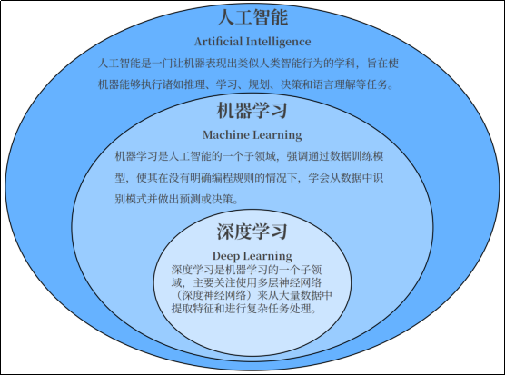

> 基本术语

- 数据集（DataSet）：多条记录的集合。
  - 训练集（TrainingSet）：用于训练模型的数据。
  - 验证集（ValidationSet）：用于调节超参数的数据。
  - 测试集（TestSet）：用于评估模型性能的数据。
- 样本（Sample）：数据集中的一条记录，是关于一个事件或对象的描述，称为一个样本。
- 特征（Feature）：数据集中一列反映事件或对象在某方面的表现或性质的事项，称为特征或属性。
- 特征向量（FeatureVector）：将样本的所有特征表示为向量的形式，输入到模型中。
- 标签（Label）：监督学习中每个样本的结果信息，也称作目标值（target）。
- 模型(Model):一个机器学习算法与训练后的参数集合，用于进行预测或分类。
- 参数(Parameter):模型通过训练学习到的值，例如线性回归中的权重和偏置。
- 超参数(HyperParameter):由用户设置的参数，不能通过训练自动学习，例如学习率、正则化系数等。

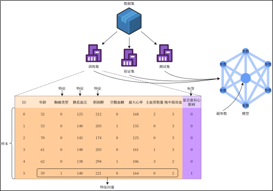

## 机器学习基本理论

### 前置概念

> 机器学习三要素

    机器学习的方法一般主要由三部分构成：模型、策略和算法，可以认为：

---

    机器学习方法 = 模型 + 策略 + 算法***

- **模型（model）**：总结数据的内在规律，用数学语言描述的参数系统；
- **策略（strategy）**：选取最优模型的评价准则；
- **算法（algorithm）**：选取最优模型的具体方法。

> 机器学习方法分类

    机器学习的方法种类繁多，并不存在一个统一的理论体系能够涵盖所有内容。从不同的角度，可以将机器学习的方法进行不同的分类:

- 通常分类:按照有无监督，机器学习可以分为:

  - 有监督学习:提供数据并提供数据对应结果的机器学习过程。
  - 无监督学习:提供数据并且不提供数据对应结果的机器学习过程。
  - 半监督：前面二者的结合。
  - 强化学习:通过与环境交互并获取延迟返回进而改进行为的学习过程。
- 根据模型性质,可以分为**概率模型/非概率模型,线性/非线性模型**等。
- 按学习技巧分类:根据算法基于的技巧，可以分为**贝叶斯学习、核方法**等。

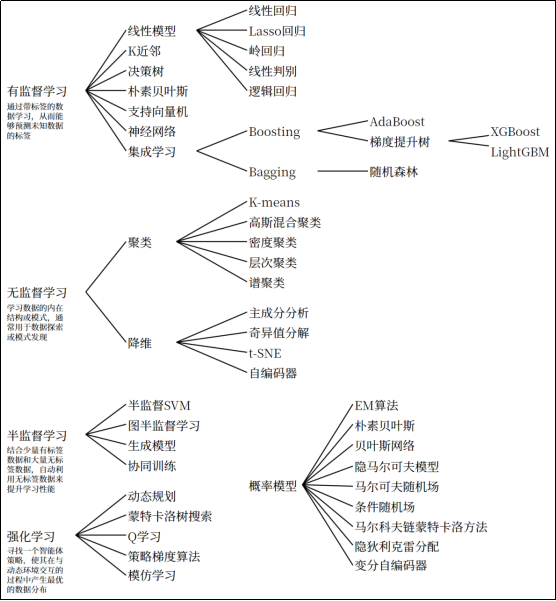

> 监督学习


    监督学习(Supervised Learning)算法构建了包含输入和所需输出的一组数据的数学模型。这些数据称为训练数据，由一组训练样本组成。

    监督学习主要包括**分类和回归**。

    当输出被限制为有限的一组值(离散数值)时使用分类算法;当输出可以具有范围内的任何数值(连续数值)时使用回归算法。

**
    相似度学习**是和回归和分类都密切相关的一类监督机器学习，它的目标是使用相似性函数从样本中学习，这个函数可以度量两个对象之间的相似度或关联度。它在排名、推荐系统、视觉识别跟踪、人脸识别等方面有很好的应用场景。

> 无监督学习

    无监督学习(Unsupervised Learning)算法采用一组仅包含输入的数据，通过寻找数据中的内在结构来进行样本点的分组或聚类。

    算法从没有被标记或分类的测试数据中学习。

    无监督学习算法不是响应反馈，而是要识别数据中的共性特征;对于一个新数据，可以通过判断其中是否存在这种特征，来做出相应的反馈。

    无监督学习的核心应用是统计学中的密度估计和聚类分析。

**应用：**

    无监督聚类应用的一个例子就是在谷歌新闻中。谷歌新闻每天都会收集很多新闻内容。它将这些新闻分组，组成有关联的新闻，然后按主题显示给用户。谷歌新闻做的就是搜索新闻事件自动地把它们聚类到一起;这些新闻事件全是同一主题的。


> 建模流程

    机器学习是由数据驱动的，核心是利用数据来“训练模型”；模型训练的结果需要用一定的方法来进行评估、优化，最终得到一个成熟的学习模型；最后就可以用这个模型来进行预测和解决问题了。

    总结监督学习建模的整体流程如下：

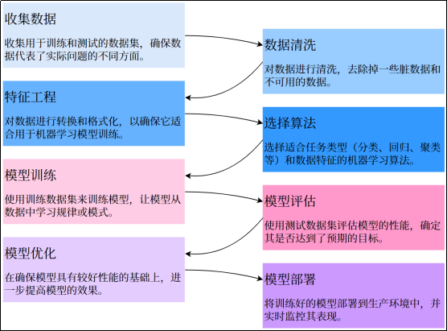

### 特征工程

> 定义

    **特征工程** （Feature Engineering）是机器学习过程中非常重要的一步，指的是通过对原始数据的处理、转换和构造，生成新的特征或选择有效的特征，从而提高模型的性能。简单来说，特征工程是将原始数据转换为可以更好地表示问题的特征形式，帮助模型更好地理解和学习数据中的规律。优秀的特征工程可以显著提高模型的表现；反之，忽视特征工程可能导致模型性能欠佳。

    实际上，特征工程是一个迭代过程。特征工程取决于具体情境。它需要大量的数据分析和领域知识。其中的原因在于，特征的有效编码可由所用的模型类型、预测变量与输出之间的关系以及模型要解决的问题来确定。在此基础上，辅以不同类型的数据集（如文本与图像）则可能更适合不同的特征工程技术。因此，要具体说明如何在给定的机器学习算法中最好地实施特征工程可能并非易事。

> **特征工程的内容**

**特征选择**

    从原始特征中挑选出与目标变量关系最密切的特征，剔除冗余、无关或噪声特征。这样可以减少模型的复杂度、加速训练过程、并减少过拟合的风险。

    特征选择不会创建新特征，也不会改变数据结构。

    （1）过滤法（Filter Method）

    基于统计测试（如卡方检验、相关系数、信息增益等）来评估特征与目标变量之间的关系，选择最相关的特征。

    （2）包裹法（Wrapper Method）

    使用模型（如递归特征消除RFE）来评估特征的重要性，并根据模型的表现进行特征选择。

    （3）嵌入法（Embedded Method）

    使用模型本身的特征选择机制（如决策树的特征重要性，L1正则化的特征选择）来选择最重要的特征。

**特征转换**

    对数据进行数学或统计处理，使其变得更加适合模型的输入要求。

    （1）归一化（Normalization）

    将特征缩放到特定的范围（通常是0到1之间）。适用于对尺度敏感的模型（如KNN、SVM）。

    （2）标准化（Standardization）

    通过减去均值并除以标准差，使特征的分布具有均值0，标准差1。

    （3）对数变换

对于有偏态的分布（如收入、价格等），对数变换可以将其转化为更接近正态分布的形式。

    （4）类别变量的编码

- 独热编码（One-Hot Encoding）：将类别型变量转换为二进制列，常用于无序类别特征。
- 标签编码（Label Encoding）：将类别型变量映射为整数，常用于有序类别特征。
- 目标编码（**Target Encoding**） **：** 将类别变量的每个类别替换为其对应目标变量的平均值或其他统计量。
- 频率编码（**Frequency Encoding**） **：** 将类别变量的每个类别替换为该类别在数据集中的出现频率。

**特征构造**

    特征构造是基于现有的特征创造出新的、更有代表性的特征。通过组合、转换、或者聚合现有的特征，形成能够更好反映数据规律的特征。

    （1）交互特征

    将两个特征组合起来，形成新的特征。例如，两个特征的乘积、和或差等。

    例如，将年龄与收入结合创建新的特征，可能能更好地反映某些模式。

    （2）统计特征

    从原始特征中提取统计值，例如求某个时间窗口的平均值、最大值、最小值、标准差等。

    例如，在时间序列数据中，你可以从原始数据中提取每个小时、每日的平均值。

    （3）日期和时间特征

    从日期时间数据中提取如星期几、月份、年份、季度等特征。

    例如，将“2000-01-01”转换为“星期几”、“是否节假日”、“月初或月末”等特征。

**特征降维**

    当数据集的特征数量非常大时，特征降维可以帮助减少计算复杂度并避免过拟合。通过降维方法，可以在保持数据本质的情况下减少特征的数量。

    （1）主成分分析（PCA）

    通过线性变换将原始特征映射到一个新的空间，使得新的特征（主成分）尽可能地保留数据的方差。

    （2）线性判别分析（LDA）

    一种监督学习的降维方法，通过最大化类间距离与类内距离的比率来降维。

    （3）t-SNE（t-Distributed Stochastic Neighbor Embedding，t分布随机近邻嵌入）

    一种非线性的降维技术，特别适合可视化高维数据。

    （4）自编码器（Auto Encoder）

    一种神经网络模型，通过压缩编码器来实现数据的降维。

> **常用方法**

    对于一个模型来说，有些特征可能很关键，而有些特征可能用处不大。

    例如：某个特征取值较接近，变化很小，可能与结果无关。某几个特征相关性较高，可能包含冗余信息。

    因此，**特征选择** 在特征工程中是最基本、也最常见的操作。

    另外，在训练模型时有时也会遇到维度灾难，即特征数量过多。我们希望能在确保不丢失重要特征的前提下减少维度的数量，来降低训练模型的难度。所以在特征工程中，也经常会用到**特征降维** 方法。

**低方差过滤法**

    对于特征的选择，可以直接基于方差来判断，这是最简单的。低方差的特征意味着该特征的所有样本值几乎相同，对预测影响极小，可以将其去掉。

```python
from sklearn.feature_selection import VarianceThreshold

# 低方差过滤：删除方差低于 0.01 的特征
var_thresh = VarianceThreshold(threshold=0.01)
X_filtered = var_thresh.fit_transform(X)
```

**相关系数法**

    通过计算特征与目标变量或特征之间的相关性，筛选出高相关性特征（与目标相关）或剔除冗余特征（特征间高度相关）。

（1）皮尔逊相关系数

    皮尔逊相关系数（Pearson Correlation）用于衡量两个变量的线性相关性，取值范围。

$$
r=\frac{ \sum_{i=1}^n (x_i - \bar x)(y_i - \bar y) }
{ \sqrt{ \sum_{i=1}^n (x_i - \bar x)^2 } \sqrt{ \sum_{i=1}^n (y_i - \bar y)^2 } }
$$

- 正相关：值接近1，说明特征随目标变量增加而增加。
- 负相关：值接近-1，说明特征随目标变量增加而减少。
- 无关：值接近0，说明特征和目标变量无明显关系。

> 示例

现有一数据集包括不同渠道广告投放金额与销售额。

使用：pandas.DataFrame.corr(method="pearson")计算各个特征与标签间的皮尔逊相关系数。

```python
import pandas as pd

advertising = pd.read_csv("data/advertising.csv")
advertising.drop(advertising.columns[0], axis=1, inplace=True)
advertising.dropna(inplace=True)
X = advertising.drop("Sales", axis=1)
y = advertising["Sales"]
# 计算皮尔逊相关系数
print(X.corrwith(y, method="pearson"))
# TV           0.782224
# Radio        0.576223
# Newspaper    0.228299
# dtype: float64
```

```python
import seaborn as sns
import matplotlib.pyplot as plt

# 计算皮尔逊相关系数矩阵
corr_matrix = advertising.corr(method="pearson")
# 可视化热力图
sns.heatmap(corr_matrix, annot=True, cmap="coolwarm", fmt=".2f")
plt.title("Feature Correlation Matrix")
plt.show()
```

（2）斯皮尔曼相关系数

    斯皮尔曼相关系数（Spearman’s  Rank Correlation Coefficient）的定义是等级变量之间的皮尔逊相关系数。用于衡量两个变量之间的单调关系，即当一个变量增加时，另一个变量是否总是增加或减少（不要求是线性关系）。适用于非线性关系或数据不符合正态分布的情况。

$$
r_s = 1 - \frac{6\sum d^2}{n(n^2 - 1)}
$$

其中:

- $d_i$是两个变量的等级之差
- $n$是样本数

斯皮尔曼相关系数的取值范围为：

- $r_s = 1$完全正相关（一个变量增加，另一个变量也总是增加）。
- $r_s = -1$完全负相关（一个变量增加，另一个变量总是减少）。
- $r_s = 0$无相关性。

> 示例

例如，现有一组每周学习时长与数学考试成绩的数据：

| 学习时长$X$ | 成绩$Y$ |
| ------------- | --------- |
| 5             | 25        |
| 37            | 79        |
| 50            | 60        |
| 60            | 72        |
| 14            | 80        |
| 6             | 58        |

按数值由小到大排出 $X$、$Y$ 的等级，并计算等级差：

| $X$ | $R_x$ | $Y$ | $R_y$ | $d=R_x-R_y$ | $d^2$ |
| ----- | ------- | ----- | ------- | ------------- | ------- |
| 5     | 1       | 25    | 1       | 0             | 0       |
| 6     | 2       | 58    | 2       | 0             | 0       |
| 14    | 3       | 80    | 6       | -3            | 9       |
| 37    | 4       | 79    | 5       | -1            | 1       |
| 50    | 5       | 60    | 3       | 2             | 4       |
| 60    | 6       | 72    | 4       | 2             | 4       |

代入斯皮尔曼相关系数公式：

$$
r_s=1-\frac{6\sum d^2}{n(n^2-1)}=1-\frac{6\times(0+0+9+1+4+4)}{6\times(36-1)}=1-\frac{6\times18}{6\times35}=1-\frac{18}{35}\approx0.486
$$

使用pandas.DataFrame.corrwith(method="spearman")计算斯皮尔曼相关系数。

```python
import pandas as pd

# 每周学习时长
X = [[5], [8], [10], [12], [15], [3], [7], [9], [14], [6]]
# 数学考试成绩
y = [55, 65, 70, 75, 85, 50, 60, 72, 80, 58]
# 计算斯皮尔曼相关系数
X = pd.DataFrame(X)
y = pd.Series(y)
print(X.corrwith(y, method="spearman"))
# 0.987879
```

(3)**主成分分析（PCA）**

    主成分分析（Principal Component Analysis，PCA）是一种常用的降维技术，通过线性变换将高维数据投影到低维空间，同时保留数据的主要变化模式。

    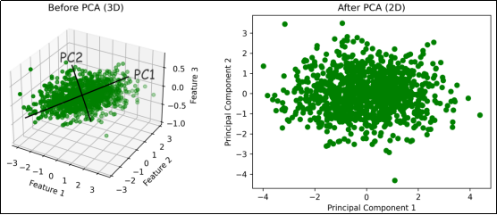

> 示例

    使用sklearn.decomposition.PCA进行主成分分析。参数n_components若为小数则表示保留多少比例的信息，为整数则表示保留多少个维度。

```python
import numpy as np
import matplotlib.pyplot as plt
from sklearn.decomposition import PCA
from sklearn.preprocessing import StandardScaler

n_samples = 1000
# 第1个主成分方向
component1 = np.random.normal(0, 1, n_samples)
# 第2个主成分方向
component2 = np.random.normal(0, 0.2, n_samples)
# 第3个方向（噪声，方差较小）
noise = np.random.normal(0, 0.1, n_samples)
# 构造3维数据
X = np.vstack([component1 - component2, component1 + component2, component2 + noise]).T

# 标准化
scaler = StandardScaler()
X_standardized = scaler.fit_transform(X)

# 应用PCA，将3维数据降维到2维
pca = PCA(n_components=2)
X_pca = pca.fit_transform(X_standardized)

# 可视化
# 转换前的3维数据可视化

fig = plt.figure(figsize=(12, 4))
ax1 = fig.add_subplot(121, projection="3d")
ax1.scatter(X[:, 0], X[:, 1], X[:, 2], c="g")
ax1.set_title("Before PCA (3D)")
ax1.set_xlabel("Feature 1")
ax1.set_ylabel("Feature 2")
ax1.set_zlabel("Feature 3")
# 转换后的2维数据可视化
ax2 = fig.add_subplot(122)
ax2.scatter(X_pca[:, 0], X_pca[:, 1], c="g")
ax2.set_title("After PCA (2D)")
ax2.set_xlabel("Principal Component 1")
ax2.set_ylabel("Principal Component 2")
plt.show()
```

### 模型评估和模型选择（重点）

> **损失函数**

    对于模型一次预测结果的好坏，需要有一个度量标准。

    对于监督学习而言，给定一个输入$\mathbf X$，选取的模型就相当于一个“决策函数” $f$，它可以输出一个预测结果 $f(\mathbf X)$，而真实的结果（标签）记为 $Y$。$f(\mathbf X)$ 和 $Y$ 之间可能会有偏差，我们就用一个损失函数（loss function）来度量预测偏差的程度，记作 $L(Y,f(\mathbf X))$。

- 损失函数用来衡量模型预测误差的大小；损失函数值越小，模型就越好；
- 损失函数是 $\mathbf X$ 和 $Y$ 的非负实值函数；

常见的损失函数有：

1）0-1 损失函数

$$
L\bigl(Y,f(\mathbf X)\bigr)=
\begin{cases}
1, & Y\neq f(\mathbf X)\\[2mm]
0, & Y=f(\mathbf X)
\end{cases}
$$

2）平方损失函数

$$
L\bigl(Y,f(\mathbf X)\bigr)=\bigl(Y-f(\mathbf X)\bigr)^2
$$

3）绝对损失函数

$$
L\bigl(Y,f(\mathbf X)\bigr)=\bigl|Y-f(\mathbf X)\bigr|
$$

4）对数似然损失函数

$$
L\bigl(Y,P(Y|\mathbf X)\bigr)=-\log P(Y|\mathbf X)
$$

> **经验误差**

    给定一个训练数据集，数据个数为$n$：

$$
T = \bigl((x_1, y_1), (x_2, y_2), \dots, (x_n, y_n)\bigr)
$$

    根据选取的损失函数，就可以计算出模型$f(x)$ 在训练集上的平均误差，称为训练误差，也被称作经验误差（empirical error）或经验风险（empirical risk）：

$$
R_{\text{emp}}(f)=\frac{1}{n}\sum_{i=1}^{n}L\bigl(y_i,f(x_i)\bigr)
$$

    类似地，在测试数据集上平均误差，被称为测试误差或者泛化误差（generalization error）。
	一般情况下对模型评估的策略，就是考察经验误差；当经验风险最小时，就认为取到了最优的模型。这种策略被称为经验风险最小化（empirical risk minimization, ERM）。

> **欠拟合与过拟合**

    **拟合** （Fitting）是指机器学习模型在训练数据上学习到规律并生成预测结果的过程。理想情况下，模型能够准确地捕捉训练数据的模式，并且在未见过的新数据（测试数据）上也有良好的表现；即模型具有良好的  **泛化能力** 。

    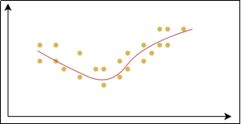

**
    欠拟合** （Underfitting）：是指模型在训练数据上表现不佳，无法很好地捕捉数据中的规律。这样的模型不仅在训练集上表现不好，在测试集上也同样表现差。

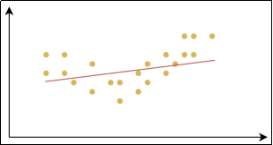

**
    过拟合** （Overfitting）：是指模型在训练数据上表现得很好，但在测试数据或新数据上表现较差的情况。过拟合的模型对训练数据中的噪声或细节过度敏感，把训练样本自身的一些特点当作了所有潜在样本都会具有的一般性质，从而失去了泛化能力。

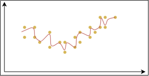

    产生欠拟合和过拟合的根本原因，是模型的复杂度过低或过高，从而导致测试误差（泛化误差）偏大。

- 欠拟合:模型在训练集和测试集上误差都比较大。模型过于简单，高偏差。
- 过拟合:模型在训练集上误差较小，但在测试集上误差较大。模型过于复杂，高方差。

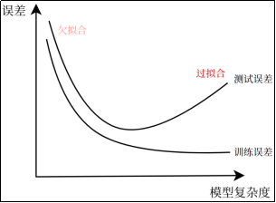

**产生原因与解决方案**

(1)欠拟合
产生原因:

- 模型复杂度不足:模型过于简单，无法捕捉数据中的复杂关系。
- 特征不足:输入特征不充分,或者特征选择不恰当，导致模型无法充分学习数据的模式。
- 训练不充分:训练过程中迭代次数太少，模型没有足够的时间学习数据的规律。
- 过强的正则化:正则化项设置过大，强制模型过于简单，导致模型无法充分拟合数据。

解决办法:

- 增加模型复杂度:选择更复杂的模型。
- 增加特征或改进特征工程:添加更多的特征或通过特征工程来创造更有信息量的特征。
- 增加训练时间:增加训练的迭代次数，让模型有更多机会去学习。
- 减少正则化强度:如果使用了正则化，尝试减小正则化的权重，以让模型更灵活

(2)过拟合

- 模型复杂度过高:模型过于复杂，参数太多。
- 训练数据不足:数据集太小，模型能记住训练数据的细节，但无法泛化到新数据。
- 特征过多:特征太多,模型可能会“记住”数据中的噪声,而不是学到真正的规律。
- 训练过长:训练时间过长，导致模型学习到训练数据中的噪声，而非数据的真正规律。

解决办法：

- 减少模型复杂度:降低模型的参数数量、使用简化的模型或降维来减小模型复杂度。
- 增加训练数据:收集更多数据，或通过数据增强来增加训练数据的多样性。
- 使用正则化:引入L1、L2正则化，避免过度拟合训练数据。
- 交叉验证:使用交叉验证技术评估模型在不同数据集上的表现，以减少过拟合的风险。
- 早停:训练时，当模型的验证损失不再下降时，提前停止训练，避免过度拟合训练
  华

> 示例演示

使用多项式在$x \in [-3, 3]上拟合$sin(x)$：

```python
import numpy as np
import matplotlib.pyplot as plt
from sklearn.model_selection import train_test_split
from sklearn.linear_model import LinearRegression
from sklearn.metrics import mean_squared_error

plt.rcParams["font.sans-serif"] = ["KaiTi"]
plt.rcParams["axes.unicode_minus"] = False

def polynomial(x, degree):
    """构成多项式，返回 [x^1,x^2,x^3,...,x^n]"""
    return np.hstack([x**i for i in range(1, degree + 1)])

# 生成随机数据
X = np.linspace(-3, 3, 300).reshape(-1, 1)
y = np.sin(X) + np.random.uniform(-0.5, 0.5, 300).reshape(-1, 1)
fig, ax = plt.subplots(1, 3, figsize=(15, 4))
ax[0].plot(X, y, "yo")
ax[1].plot(X, y, "yo")
ax[2].plot(X, y, "yo")

# 划分训练集和测试集
x_train, x_test, y_train, y_test = train_test_split(X, y, test_size=0.2, random_state=42)

# 创建线性回归模型
model = LinearRegression()

# 欠拟合
x_train1 = x_train
x_test1 = x_test
model.fit(x_train1, y_train)  # 模型训练
y_pred1 = model.predict(x_test1)  # 预测
ax[0].plot(np.array([[-3], [3]]), model.predict(np.array([[-3], [3]])), "c")  # 绘制曲线
ax[0].text(-3, 1, f"测试集均方误差：{mean_squared_error(y_test, y_pred1):.4f}")
ax[0].text(-3, 1.3, f"训练集均方误差：{mean_squared_error(y_train, model.predict(x_train1)):.4f}")

# 恰好拟合
x_train2 = polynomial(x_train, 5)
x_test2 = polynomial(x_test, 5)
model.fit(x_train2, y_train)  # 模型训练
y_pred2 = model.predict(x_test2)  # 预测
ax[1].plot(X, model.predict(polynomial(X, 5)), "k")  # 绘制曲线
ax[1].text(-3, 1, f"测试集均方误差：{mean_squared_error(y_test, y_pred2):.4f}")
ax[1].text(-3, 1.3, f"训练集均方误差：{mean_squared_error(y_train, model.predict(x_train2)):.4f}")

# 过拟合
x_train3 = polynomial(x_train, 20)
x_test3 = polynomial(x_test, 20)
model.fit(x_train3, y_train)  # 模型训练
y_pred3 = model.predict(x_test3)  # 预测
ax[2].plot(X, model.predict(polynomial(X, 20)), "r")  # 绘制曲线
ax[2].text(-3, 1, f"测试集均方误差：{mean_squared_error(y_test, y_pred3):.4f}")
ax[2].text(-3, 1.3, f"训练集均方误差：{mean_squared_error(y_train, model.predict(x_train3)):.4f}")
plt.show()
```

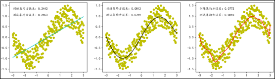

- 当多项式次数较低时，模型过于简单，拟合效果较差。
- 当多项式次数增加后，模型复杂度适中，拟合效果较好，训练误差和测试误差均较低。
- 当多项式次数继续增加，模型变得过于复杂，过度学习了噪声，导致训练误差较低而测试误差较高。

> 正则化

    正则化（Regularization）是一种在训练机器学习模型时，在损失函数中添加额外项，来惩罚过大的参数，进而限制模型复杂度、避免过拟合，提高模型泛化能力的技术。

    如在平方损失函数中加入正则化项$\lambda$：

$$
\text{Loss}
= \underbrace{\frac{1}{n}\sum_{i=1}^n\bigl(f(x_i)-y_i\bigr)^2}_{\text{原损失函数}}
+ \underbrace{\lambda\|\mathbf w\|^2}_{\text{正则化项}}
$$

- 原损失函数 $\displaystyle\frac{1}{n}\sum_{i=1}^n\bigl(f(x_i)-y_i\bigr)^2$ 的目的：更好地拟合数据集；
- 正则化项 $\lambda\|\mathbf w\|^2$ 的目的：减小参数的大小，从而降低模型的复杂度。

  这里的$\lambda$ 是正则化系数，用来表示惩罚项的权重。正则化系数不属于模型的参数，无法通过训练学习得到，需要在模型训练开始之前手动设置，这种参数被称为“超参数”。
  两者相互平衡，在模型的拟合能力（偏差）和复杂度之间找到最佳折中。

  常见的正则化技术有L1正则化和L2正则化。

**L1 正则化（Lasso 回归）**

L1 正则化在损失函数中加入参数的绝对值之和：

$$
Loss_{L1} = 原 Loss + \lambda\sum_{i=1}^{k}|w_i|
$$

    L1 正则化通过惩罚模型参数的绝对值，使得部分权重趋近 0 甚至变为 0。这会导致特征选择，即模型会自动“丢弃”一些不重要的特征。L1 正则化有助于创建稀疏模型（即许多参数为 0）。在解决回归问题时，使用 L1 正则化也被称为“Lasso 回归”。
    超参数$\lambda$ 控制着正则化的强度。较大的 $\lambda$ 值意味着强烈的正则化，会使模型更简单，可能导致欠拟合；而较小的 $\lambda$ 值则会使模型更复杂，可能导致过拟合。

**L2 正则化（Ridge 回归，岭回归）**
	L2 正则化在损失函数中加入参数的平方之和：

$$
Loss_{L2} = 原 Loss + \lambda\sum_{i=1}^{k}w_i^2
$$

    L2 正则化通过惩罚模型参数的平方，使得所有参数都变得更小，但不会将参数强行压缩为 0。它会使得模型尽量平滑，从而防止过拟合。
	在解决回归问题时，使用 L2 正则化也被称为“岭回归”。

**Elastic Net 正则化（弹性网络回归）**
	Elastic Net 正则化结合了 L1 和 L2 正则化，通过调整两个正则化项的比例来取得平衡，从而同时具备稀疏性和稳定性的优点：

$$
Loss_{ElasticNet}
= 原 Loss
+ \lambda\Bigl[\alpha\sum_{i}^{n}|w_i| + \frac{1-\alpha}{2}\sum_{i=1}^{n}w_j^2\Bigr]
$$

其中 $\alpha\in[0,1]$，决定 L1 与 L2 的权重。

> 正则化案例

    同样以使用多项式在$x \in [-3, 3]$上拟合$sin(x)$为例，分别不使用正则化、使用L1正则化、使用L2正则化进行拟合。

```python
import numpy as np
import matplotlib.pyplot as plt
from sklearn.model_selection import train_test_split
from sklearn.linear_model import LinearRegression, Lasso, Ridge
from sklearn.metrics import mean_squared_error

plt.rcParams["font.sans-serif"] = ["KaiTi"]
plt.rcParams["axes.unicode_minus"] = False

def polynomial(x, degree):
    """构成多项式，返回 [x^1,x^2,x^3,...,x^n]"""
    return np.hstack([x**i for i in range(1, degree + 1)])

# 生成随机数据
X = np.linspace(-3, 3, 300).reshape(-1, 1)
y = np.sin(X) + np.random.uniform(-0.5, 0.5, X.size).reshape(-1, 1)
fig, ax = plt.subplots(2, 3, figsize=(15, 8))
ax[0, 0].plot(X, y, "yo")
ax[0, 1].plot(X, y, "yo")
ax[0, 2].plot(X, y, "yo")

# 划分训练集和测试集
x_train, x_test, y_train, y_test = train_test_split(X, y, test_size=0.2, random_state=42)
x_train1 = polynomial(x_train, 20)
x_test1 = polynomial(x_test, 20)

# 拟合
model = LinearRegression()
model.fit(x_train1, y_train)  # 模型训练
y_pred3 = model.predict(x_test1)  # 预测
ax[0, 0].plot(X, model.predict(polynomial(X, 20)), "r")  # 绘制曲线
ax[0, 0].text(-3, 1, f"测试集均方误差：{mean_squared_error(y_test, y_pred3):.4f}")
ax[1, 0].bar(np.arange(20), model.coef_.reshape(-1))  # 绘制所有系数

# L1正则化-Lasso回归
lasso = Lasso(alpha=0.01)
lasso.fit(x_train1, y_train)  # 模型训练
y_pred3 = lasso.predict(x_test1)  # 预测
ax[0, 1].plot(X, lasso.predict(polynomial(X, 20)), "r")  # 绘制曲线
ax[0, 1].text(-3, 1, f"测试集均方误差：{mean_squared_error(y_test, y_pred3):.4f}")
ax[0, 1].text(-3, 1.2, "Lasso回归")
ax[1, 1].bar(np.arange(20), lasso.coef_)  # 绘制所有系数

# L2正则化-岭回归
ridge = Ridge(alpha=1)
ridge.fit(x_train1, y_train)  # 模型训练
y_pred3 = ridge.predict(x_test1)  # 预测
ax[0, 2].plot(X, ridge.predict(polynomial(X, 20)), "r")  # 绘制曲线
ax[0, 2].text(-3, 1, f"测试集均方误差：{mean_squared_error(y_test, y_pred3):.4f}")
ax[0, 2].text(-3, 1.2, "岭回归")
ax[1, 2].bar(np.arange(20), ridge.coef_)  # 绘制所有系数
plt.show()
```

> 交叉验证

    交叉验证（Cross-Validation）是一种评估模型泛化能力的方法，通过将数据集划分为多个子集，反复进行训练和验证，以减少因单次数据划分带来的随机性误差。通过交叉验证能更可靠地估计模型在未知数据上的表现，亦能避免因单次数据划分不合理导致的模型过拟合或欠拟合。

1）**简单交叉验证（Hold-Out Validation）**

    将数据划分为训练集和验证集（如70%训练，30%验证）。结果受单次划分影响较大，可能高估或低估模型性能。

2）**k折交叉验证（k-Fold Cross-Validation）**

    将数据均匀分为k个子集（称为“折”），每次用k−1折训练，剩余1折验证，重复k次后取平均性能。充分利用数据，结果更稳定。

    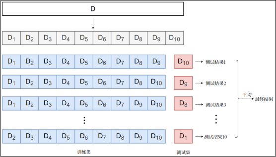

3）**留一交叉验证（Leave-One-Out，LOO）**

    每次仅留一个样本作为验证集，其余全部用于训练，重复直到所有样本都被验证一次。适用于小数据集，计算成本极高。

### 模型求解算法

    正则化可以有效防止过拟合，增强模型的泛化能力。这时模型的评估策略，就是让结构化的经验风险最小，即增加了正则化项的损失函数最小，称为**结构风险最小化** （Structural Risk Minimization，SRM）。

$$
\sum_{i=1}^{n} L\bigl(y_i, f(x_i)\bigr) + \lambda\, J(\theta)
$$

这其实就是求解一个最优化问题。代入训练集所有数据 $(x_i,y_i)$，要求最小值的目标函数就是模型中参数 $\theta$ 的函数。
具体求解的算法，可以利用数学公式直接计算解析解，也可以使用迭代算法。

> 解析法

    如果模型损失函数的最小值可以通过数学公式进行严格推导，得到一个解析解，那么就直接得到了最优模型的全部参数。这种方法称作解析法。

1）**特点**

- 适用条件：目标函数必须可导，且导数方程有解析解。
- 优点：直接且精确；计算高效；
- 缺点：适用条件较为苛刻；特征维度较大时，矩阵求逆计算复杂度极高。

2）应用示例

线性回归问题：可以采用“最小二乘法”求得解析解。

$$
\text{Loss}_{\text{MSE}} = \frac{1}{n}(\mathbf X\boldsymbol\beta - \mathbf y)^\top(\mathbf X\boldsymbol\beta - \mathbf y)
$$

令梯度为零：

$$
\nabla_{\!\boldsymbol\beta}\,\text{Loss}_{\text{MSE}} = \frac{2}{n}\mathbf X^\top(\mathbf X\boldsymbol\beta - \mathbf y) = \mathbf 0
$$

解得

$$
\boldsymbol\beta = (\mathbf X^\top\mathbf X)^{-1}\mathbf X^\top\mathbf y
$$

---

线性回归 L2 正则化（Ridge 回归，岭回归）可以得到解析解如下：

$$
\text{Loss}_{\text{L2}} = \frac{1}{n}(\mathbf X\boldsymbol\beta - \mathbf y)^\top(\mathbf X\boldsymbol\beta - \mathbf y) + \frac{\lambda}{n}\boldsymbol\beta^\top\boldsymbol\beta
$$

令梯度为零：

$$
\nabla_{\!\boldsymbol\beta}\,\text{Loss}_{\text{L2}} = \frac{2}{n}\mathbf X^\top(\mathbf X\boldsymbol\beta - \mathbf y) + \frac{2}{n}\lambda\boldsymbol\beta = \mathbf 0
$$

解得

$$
\boldsymbol\beta = (\mathbf X^\top\mathbf X + \lambda\mathbf I)^{-1}\mathbf X^\top\mathbf y
$$

由于加入的对角矩阵 $\mathbf I$ 就像一条“山岭”，因此 L2 正则化也称作“岭回归”。

> 梯度下降法（重点）

**梯度下降法** （gradient descent）是一种常用的一阶优化方法，是求解无约束优化问题最简单、最经典的方法之一。梯度下降法是迭代算法，基本思路就是先选取一个适当的初始值，然后沿着梯度方向或者负梯度方向，不停地更新参数，最终取到极小值。

    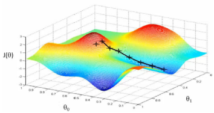

- 梯度方向：函数变化增长最快的方向（变量沿此方向变化时函数增长最快）
- 负梯度方向：函数变化减少最快的方向（变量沿此方向变化时函数减少最快）

  因为损失函数是系数的函数，那么如果系数沿着损失函数的负梯度方向变化，此时损失函数减少最快，能够以最快速度下降到极小值。

$$
\theta_{k+1} = \theta_k - \alpha\,\nabla L(\theta_k)
$$

这里的 $\nabla L(\theta)$ 是参数取值为 $\theta$ 时损失函数 $L$ 的梯度；$\alpha$ 是每次迭代的“步长”，被称为“学习率”。学习率也是一个常见的超参数，需要手动设置，选择不当会导致收敛失败。

1）特点

梯度下降不一定能够找到全局的最优解，有可能是一个局部最优解。

- 优点：适用性广；计算简单；
- 缺点：收敛速度慢；可能陷入局部最优。

2）分类

（1）批量梯度下降（Batch Gradient Descent，BGD）

每次迭代使用全部训练数据计算梯度。

- 优点：稳定收敛；
- 缺点：计算开销大。

（2）随机梯度下降（Stochastic Gradient Descent，SGD）

每次迭代随机选取一个样本计算梯度。

- 优点：速度快，适合大规模数据；
- 缺点：梯度更新方向不稳定，优化过程震荡较大，可能难以收敛。

（3）小批量梯度下降（Mini-batch Gradient Descent，MBGD）

    每次迭代使用一小批样本（如 32、64 个）计算梯度。

    平衡了BGD的稳定性和SGD的速度，是最常用的方法。

3）**梯度下降法计算步骤**

- 初始化参数：随机选择初始参数
- 计算梯度：在当前参数下，计算损失函数的梯度
- 更新参数：沿负梯度方向调整参数
- 重复迭代：直到满足停止条件（如梯度接近零、达到最大迭代次数等）

4）**代码实现**

    我们以一个单变量函数为例，介绍梯度下降法的代码实现。
    设$f(x)=x^2$，求 $x$ 为何值时，$f(x)=2$。

目标函数

$$
J(x)=\bigl(f(x)-2\bigr)^2=(x^2-2)^2
$$

    原问题等价于求$x$ 为何值时目标函数取得最小值。

    使用梯度下降法求解：

超参数设置：

- 初始值：$x = 1$
- 学习率：$\alpha = 0.1$
- 梯度计算：$\frac{dJ(x)}{dx}= 2(x^2 - 2)\cdot 2x= 4x^3 - 8x$
- 迭代过程（学习率 $\alpha=0.1$）：

**第 1 步：**
$x_1=1,\quad J(x_1)=(1^2-2)^2=1,\quad J'(x_1)=4\times1\times(1^2-2)=-4$
$x_2=x_1-\alpha J'(x_1)=1-0.1\times(-4)=1.4$

**第 2 步：**
$x_2=1.4,\quad J(x_2)=(1.4^2-2)^2=0.0016,\quad J'(x_2)=4\times1.4\times(1.4^2-2)=-0.2240$
$x_3=x_2-\alpha J'(x_2)=1.4-0.1\times(-0.2240)=1.4224$

$\quad\vdots$

**第 $n$ 步：**
$x_n=1.414213,\quad J(x_n)=2.53\times10^{-12},\quad J'(x_n)=8.8817\times10^{-15}$

 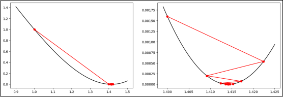

示例代码：

```python
def J(x):
    """目标函数"""
    return (x**2 - 2) ** 2

def gradient(x):
    """梯度"""
    return 4 * x**3 - 8 * x

x = 1  # x的初始值
alpha = 0.1  # 学习率
while (j := J(x)) > 1e-30:  # 当目标函数的值小于10的-30次幂时停止计算
    print(f"x={x}\tJ={j}")
    grad = gradient(x)  # 求解梯度
    x = x - alpha * grad  # 更新参数
```

5)**应用示例**

- L1正则化（Lasso回归）

$$
\text{Loss}_{\text{L1}} = \frac{1}{n}(\sum_{i=1}^{n}\bigl(f(x_i)-y_i\bigr)^2 + \lambda\sum_{j=1}^{k}|w_j|)
$$

$$
\frac{\partial\,\text{Loss}_{\text{L1}}}{\partial w_j}
= \frac{1}{n}(2\sum_{i=1}^{n}x_{ij}\bigl(f(x_i)-y_i\bigr) + \lambda\,\text{sign}(w_j))
$$

其中

$$
\text{sign}(w_j)=
\begin{cases}
+1, & w_j>0\\[2mm]
0, & w_j=0\\[2mm]
-1, & w_j<0
\end{cases}
$$

参数更新：

$$
w_j \leftarrow w_j - \alpha\Bigl[\frac{1}{n}\sum_{i=1}^{n}x_{ij}\bigl(f(x_i)-y_i\bigr) + \lambda\,\text{sign}(w_j)\Bigr]
$$

可见L1正则化项的梯度是一个常数$\frac{\lambda}{n}$，当$\omega_j$很小时会直接变成0，导致稀疏性。

- L2 正则化（Ridge 回归，岭回归）

梯度下降法求解的推导过程如下：

$$
\text{Loss}_{\text{L2}} = \frac{1}{n}(\sum_{i=1}^{n}\bigl(f(x_i)-y_i\bigr)^2 + \lambda\sum_{j=1}^{k}w_j^2)
$$

$$
\frac{\partial\,\text{Loss}_{\text{L2}}}{\partial w_j}
= \frac{1}{n}(2\sum_{i=1}^{n}x_{ij}\bigl(f(x_i)-y_i\bigr) + 2\lambda w_j)
$$

梯度更新：

$$
w_j \leftarrow w_j - \alpha\Bigl[\frac{2}{n}\sum_{i=1}^{n}x_{ij}\bigl(f(x_i)-y_i\bigr) + \frac{2\lambda}{n} w_j\Bigr]
$$

    可见 L2 正则化项的梯度是$\lambda w_j$，相当于在每次更新时都对 $w_j$ 进行缩小，但不会直接变为 0。

### 模型评价指标（重点）

    对学习的泛化性能进行评估，不仅需要有效可行的实验估计方法，还需要有衡量模型泛化能力的评价指标，也叫做性能度量（performance measure）。

> **回归模型评价指标**

最常用的是**均方误差 （MSE， Mean Squared Error）**

1）**平均绝对误差（MAE）**

    MAE对异常值不敏感，解释直观。适用于数据包含异常值的场景。

2）**均方误差（MSE）**

    MSE会放大较大误差，对异常值敏感。适用于需要惩罚大误差的场景。

3）**均方根误差（RMSE）**

    与MSE类似，但量纲与目标变量一致。适用于需要直观误差量纲的场景。如果一味地试图降低RMSE，可能会导致模型对异常值也拟合度很高，容易过拟合。

4）**R²（决定系数）**

    衡量模型对目标变量的解释能力，越接近1越好，对异常值敏感。

> 分类模型评价指标

    对于分类问题，最常用的指标就是“准确率”（Accuracy），它定义为分类器对测试集正确分类的样本数与总样本数之比。此外还有一系列常用的评价指标。

1）**混淆矩阵**

    混淆矩阵（Confusion Matrix）是用于评估分类模型性能的工具，展示了模型预测结果与实际标签的对比情况。

    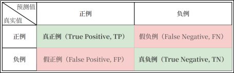

    例如，有10个样本。6个是猫，4个是狗。假设以猫为正例，模型预测对了5个猫，2个狗。

    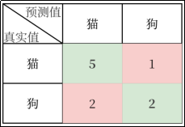

```python
import pandas as pd
import seaborn as sns
from sklearn.metrics import confusion_matrix

label = ["猫", "狗"]  # 标签
y_true = ["猫", "猫", "猫", "猫", "猫", "猫", "狗", "狗", "狗", "狗"]  # 真实值
y_pred1 = ["猫", "猫", "狗", "猫", "猫", "猫", "猫", "猫", "狗", "狗"]  # 预测值
matrix1 = confusion_matrix(y_true, y_pred1, labels=label)  # 混淆矩阵
print(pd.DataFrame(matrix1, columns=label, index=label))
sns.heatmap(matrix1, annot=True, fmt='d', cmap='Greens')
```

2）**准确率（Accuracy）**

    正确预测的比例。

$$
Accuracy = \frac{TP+TN}{TP+FP+TN+FN}
$$

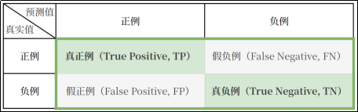

上述案例中,$Accuracy = \frac{5+2}{10}=0.7$

3）**精确率（Precision）**

    预测为正例的样本中实际为正例的比例，也叫查准率。

$$
Precision =  \frac{TP}{TP+FP}
$$

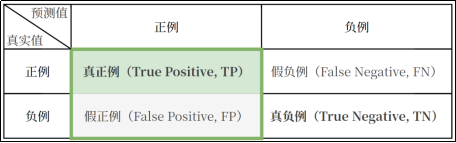

上述案例中,$Precision = \frac{5}{5+2} = 0.7143$

4) **召回率（Recall）**

实际为正类的样本中预测为正类的比例，也叫查全率。

$$
Precision =  \frac{TP}{TP+FN}
$$

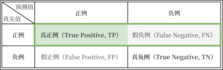

上述案例中$Recall = \frac{5}{11} = 0.8333$

5）**F1分数（F1 Score）**

    精确率和召回率的调和平均。

$$
F1Score = \frac{2\times Precision \times Recall}{Precision + Recall}
$$

上述案例中$F1Score = \frac{2 \times \frac{5}{5+2} \times \frac{5}{5+1}}{\frac{5}{5+2}+\frac{5}{5+1}} =0.7692$

6）**ROC曲线**

- 真正例率（TPR）：实际为正例，被预测为正例的比例，即召回率。

  $$
  TPR =\frac{TP}{实际正例数}=\frac{TP}{TP+FN}
  $$
- 假正例率（FPR）：实际为负例，被预测为正例的比例。

  $$
  FPR =\frac{FP}{实际正例数}=\frac{FP}{TP+FN}
  $$
- 阈值（Threshold）：根据阈值将概率转换为类别标签。

  ROC曲线（Receiver Operating Characteristic Curve，受试者工作特征）是评估二分类模型性能的工具，以假正例率（FPR）为横轴，以真正例率（TPR）为纵轴，展示不同阈值下模型的表现。绘制ROC曲线时，从高到低调整阈值，计算每个阈值的TPR和FPR并绘制所有阈值的点，形成ROC曲线

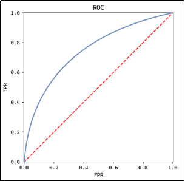

7）案例，绘制ROC曲线

假设一个二分类模型的真实标签和模型输出概率如下：

| 样本 | 真实标签 | 模型输出概率 |
| ---- | -------- | ------------ |
| 1    | 1        | 0.9          |
| 2    | 0        | 0.4          |
| 3    | 1        | 0.6          |
| 4    | 1        | 0.8          |
| 5    | 0        | 0.2          |
| 6    | 0        | 0.7          |
| 7    | 1        | 0.3          |
| 8    | 0        | 0.5          |

按模型输出概率排序：

| 样本 | 真实标签 | 模型输出概率 |
| ---- | -------- | ------------ |
| 1    | 1        | 0.9          |
| 4    | 1        | 0.8          |
| 6    | 0        | 0.7          |
| 3    | 1        | 0.6          |
| 8    | 0        | 0.5          |
| 2    | 0        | 0.4          |
| 7    | 1        | 0.3          |
| 5    | 0        | 0.2          |

调整阈值，计算 TPR 和 FPR：

$$
\text{TPR} = \frac{\text{TP}}{\text{TP} + \text{FN}}, \quad
\text{FPR} = \frac{\text{FP}}{\text{FP} + \text{TN}}
$$

阈值 $= 0.9$：

$$
\mathrm{TPR}=\frac{0}{4}=0,\quad \mathrm{FPR}=\frac{0}{4}=0,\quad \text{点坐标}(0,0)
$$

阈值 $= 0.8$：

$$
\mathrm{TPR}=\frac{1}{4}=0.25,\quad \mathrm{FPR}=\frac{0}{4}=0,\quad \text{点坐标}(0,0.25)
$$

阈值 $= 0.7$：

$$
\mathrm{TPR}=\frac{2}{4}=0.5,\quad \mathrm{FPR}=\frac{0}{4}=0,\quad \text{点坐标}(0,0.5)
$$

阈值 $= 0.6$：

$$
\mathrm{TPR}=\frac{2}{4}=0.5,\quad \mathrm{FPR}=\frac{1}{4}=0.25,\quad \text{点坐标}(0.25,0.5)
$$

阈值 $= 0.5$：

$$
\mathrm{TPR}=\frac{3}{4}=0.75,\quad \mathrm{FPR}=\frac{1}{4}=0.25,\quad \text{点坐标}(0.25,0.75)
$$

阈值 $= 0.4$：

$$
\mathrm{TPR}=\frac{3}{4}=0.75,\quad \mathrm{FPR}=\frac{2}{4}=0.5,\quad \text{点坐标}(0.5,0.75)
$$

阈值 $= 0.3$：

$$
\mathrm{TPR}=\frac{3}{4}=0.75,\quad \mathrm{FPR}=\frac{3}{4}=0.75,\quad \text{点坐标}(0.75,0.75)
$$

阈值 $= 0.2$：

$$
\mathrm{TPR}=\frac{4}{4}=1,\quad \mathrm{FPR}=\frac{3}{4}=0.75,\quad \text{点坐标}(0.75,1)
$$

根据坐标点绘制 ROC 曲线：

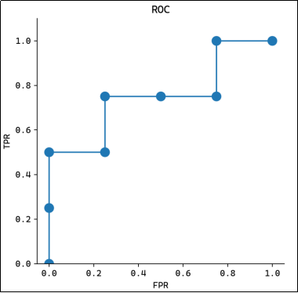

8）**AUC值**

    AUC值代表ROC曲线下的面积，用于量化模型性能。AUC值越大，模型区分正负类的能力越强，模型性能越好。AUC值=0.5表示模型接近随机猜测，AUC值=1代表完美模型。

    可通过sklearn.metrics.roc_auc_score计算AUC值。

```python
from sklearn.metrics import roc_auc_score

auc_score = roc_auc_score(y_true, y_score)
# y_true: 真实标签（0 或 1）
# y_score: 正例的概率值或置信度
```

